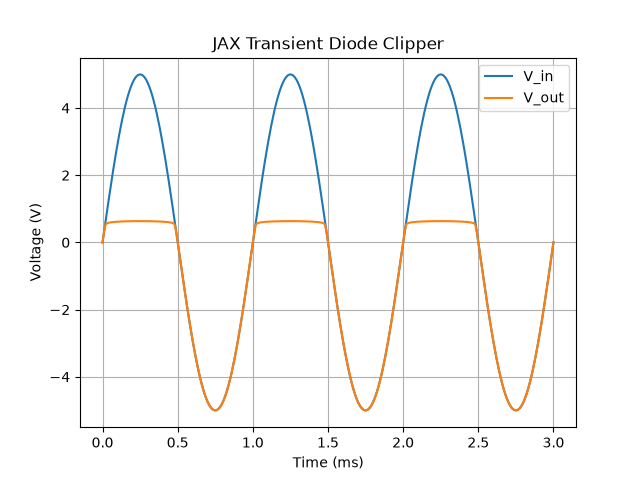

Example 7: Fast JAX Transient Diode Clipper
-------------------------------------------

This example shows how to use the JAX-accelerated Transient solver (`JAXTransient`) to compute the time-domain behavior of a non-linear circuit. 

The circuit consists of a sine wave source driving a resistor and a diode. The diode acts as a clipper. The `JAXTransient` uses auto-differentiated Jacobians and compiled execution paths, making it extremely fast.

.. literalinclude:: example7.py

The script generates the following plot:

