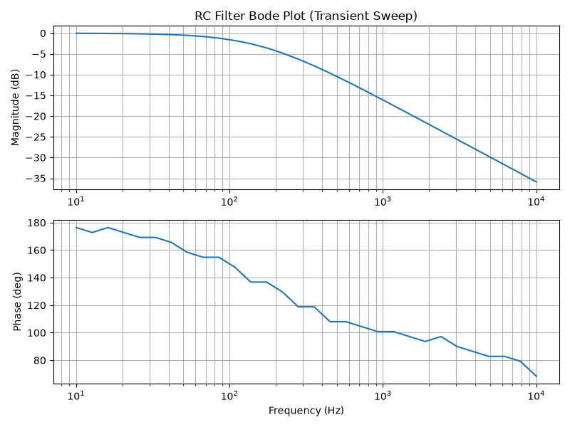

Example 8: Frequency Response via JAX Transient Sweep
-----------------------------------------------------

This example leverages the extremely fast compiled execution of `JAXTransient` to perform a frequency sweep in the time-domain. We characterize the frequency response of an RC low-pass filter (which is normally done via AC analysis) by actually simulating the transient response at multiple frequencies.

Because JAX caches the compiled computation graph after the first execution, the 29 subsequent frequency simulations run at blazing speeds. The script measures the steady-state amplitude and phase shift at each frequency to construct a Bode plot.

.. literalinclude:: example8.py

The script generates the following Bode plot:

