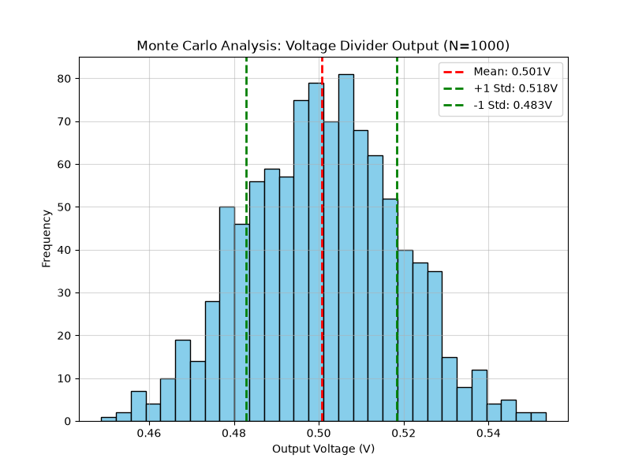

Example 9: Monte Carlo Analysis with JAX Transient
--------------------------------------------------

This example highlights the power of JAX's Just-In-Time (JIT) compilation for statistical circuit analysis. 

We construct a simple resistive voltage divider that divides a 1V DC input by 2. We then apply a normal distribution with a ±5% standard deviation to both resistors. By running 1,000 transient simulations in a loop, we can observe the statistical distribution of the output voltage. Because the solver graph is cached after the first compilation, the subsequent 999 runs execute incredibly fast.

.. literalinclude:: example9.py

The script generates the following histogram of the output voltage distribution:

