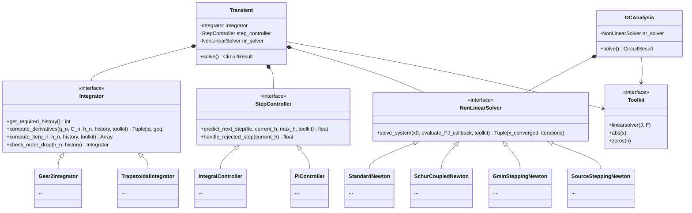

# Modular Engine Architecture: Unified PyCircuit Solvers

## 1. Motivation
Currently, PyCircuit's `transient.py` and `dcanalysis.py` engines suffer from tightly coupled code and duplicated mathematical loops. 
- `Transient` intertwines Numerical Integration, Step-Size Control, and Newton-Raphson into a monolithic loop. 
- `DCAnalysis` uses a standalone `fsolve` function for Newton-Raphson, but handles continuation methods (like `GminStepping`) via fragile nested try-catch blocks.
- Furthermore, PyCircuit must robustly support three distinct backends: **Numeric (NumPy)**, **Sympy**, and **Symbolic-Poly**. Code duplication severely increases the risk of backend incompatibility.

## 2. Proposed Architecture: The Three Pillars
We propose unifying the entirety of PyCircuit's time-domain and DC simulations into a strictly modular orchestration engine utilizing the **Strategy Design Pattern**. The orchestrators (`Transient` and `DCAnalysis`) will remain agnostic to the math, relying entirely on three injectable, toolkit-aware interfaces.



## 3. The Interfaces

All interfaces must accept a `toolkit` dependency. This ensures that whether the system is solving `numpy` float64 arrays or `symbolic-poly` rational polynomials, the solver logic remains backend-agnostic.

### Pillar 1: `Integrator`
Encapsulates all time-domain mathematical discretization for Transient analysis.
- **`compute_derivatives()`**: Transforms non-linear differential equations into algebraic equivalents ($i_q$ and $g_{eq}$), factoring in Variable Step Size coefficients using `toolkit.array`.
- **`compute_lte()`**: Encapsulates the specific Taylor series truncation error terms using `toolkit.maximum` and `toolkit.abs`.

### Pillar 2: `StepController`
Encapsulates step size heuristics and damping logic for Transient analysis.
- **`predict_next_step()`**: Computes the optimal step size $h_{n+1}$ (e.g., PI Controller vs Integral Controller). 

### Pillar 3: `NonLinearSolver`
The core engine for both `Transient` and `DCAnalysis`. It takes a generic `evaluate_FJ_callback` and attempts to find the root.
- **`StandardNewton`**: Formulates the standard full-matrix Jacobian and solves using `toolkit.linearsolver(J, F)`.
- **`SchurCoupledNewton`**: Isolates non-linear sub-blocks from linear elements.

**Continuation Methods as Decorators:**
A massive advantage of this Strategy Pattern is that continuation methods (`GminStepping`, `SourceStepping`) can be implemented natively using the **Decorator Pattern**. They act as wrappers around a base `NonLinearSolver`.

If the base Newton method fails, the `GminSteppingNewton` wrapper intercepts the failure, iteratively modifies the `evaluate_FJ_callback` to inject a diagonal $G_{min}$ conductivity into the Jacobian, and feeds this easier sub-problem back into the base solver. 

```python
class GminSteppingNewton(NonLinearSolver):
    def __init__(self, base_solver: NonLinearSolver):
        self.base_solver = base_solver

    def solve_system(self, x0, eval_FJ, toolkit):
        try:
            return self.base_solver.solve_system(x0, eval_FJ, toolkit)
        except NoConvergenceError:
            x_curr = x0
            for gmin in [1e-3, 1e-4, 1e-5, ..., 1e-12]:
                def eval_FJ_with_gmin(x):
                    F, J = eval_FJ(x)
                    J_gmin = J + toolkit.eye(len(J)) * gmin
                    F_gmin = F + x * gmin
                    return F_gmin, J_gmin
                # Use base solver on the guided sub-problem
                x_curr = self.base_solver.solve_system(x_curr, eval_FJ_with_gmin, toolkit)
                
            return self.base_solver.solve_system(x_curr, eval_FJ, toolkit)
```

This guarantees:
1. **Total Isolation**: `DCAnalysis` and `Transient` do not need any complex try/catch loops. They simply execute: `solver.solve_system()`.
2. **Infinite Composability**: Solvers can be stacked arbitrarily. `SourceSteppingNewton(GminSteppingNewton(StandardNewton()))`.
3. **Transient Fallback**: Because the wrapper only modifies the Jacobian/F-vector dynamically, Gmin stepping can theoretically be triggered *mid-transient analysis* if a single violent time-step fails to converge normally!

## 4. Unifying Transient and DC Analysis
By centralizing the `NonLinearSolver`, we achieve a massive architectural victory: **DC and Transient share the exact same root-finding engine.**

**DC Analysis Flow:**
```python
def solve(self):
    # DC passes a callback that only evaluates static G and i
    def eval_dc(x):
        return self.cir.i(x), self.cir.G(x)
        
    return self.nr_solver.solve_system(x0, eval_dc, self.toolkit)
```

**Transient Analysis Flow:**
```python
def solve(self, tend, x0):
    t = 0.0; x = x0; h = self.step_controller.initial_step()
    while t < tend:
        h = min(h, tend - t)
        active_integrator = self.integrator.check_order_drop(h, self.history)
        
        # Transient passes a callback that adds the integration components
        def eval_transient(x_guess):
            iq, Geq = active_integrator.compute_derivatives(x_guess, ...)
            F = self.cir.i(x_guess) + iq + self.cir.u(t + h)
            J = self.cir.G(x_guess) + Geq
            return F, J
            
        try:
            x_next, _ = self.nr_solver.solve_system(x, eval_transient, self.toolkit)
        except NoConvergenceError:
            h = self.step_controller.handle_rejected_step(h)
            continue
            
        # Error prediction and commit...
```

## 5. End Result
- **Universal Upgrades**: If we build a highly stable `DampedNewton` solver, both DC operating-point and Transient simulations immediately benefit.
- **Toolkit Resilience**: By mandating `toolkit` as a dependency passed into all interfaces, we structurally guarantee that `numpy`, `sympy`, and `symbolic-poly` cannot break the high-level control loops.
- **Maintainability**: Duplicated NR loops and fragile try-catch continuation logic are permanently eliminated.
