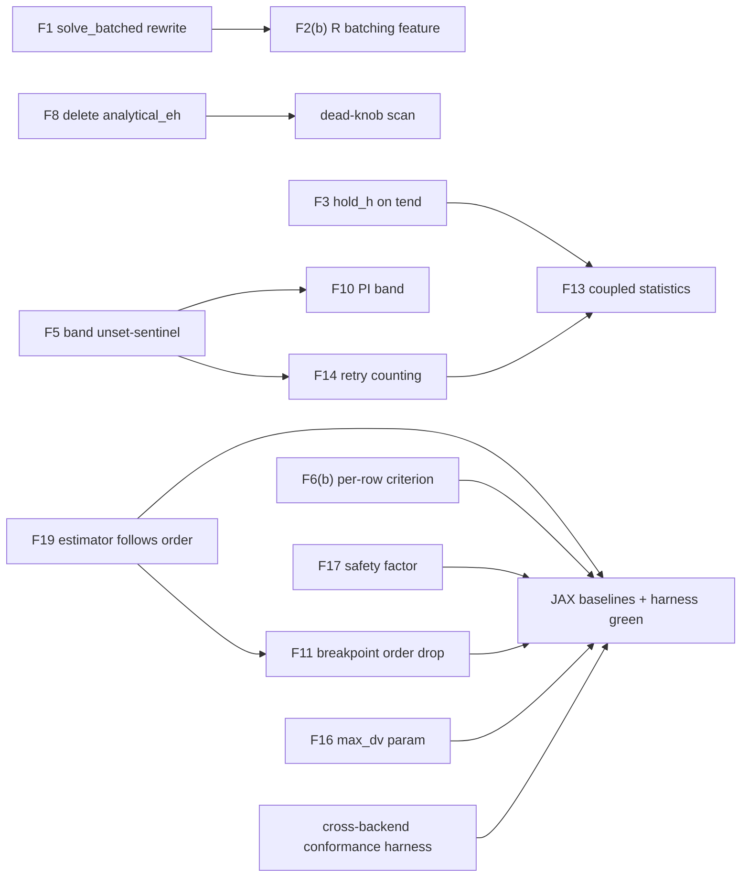

# Transient code review — 2026-08-20

**Branch:** `cna-jax-vectorization` (at `1885931` plus working tree)
**Scope:** `pycircuit/circuit/transient.py` (2457 lines), `integrator.py`, `stepcontroller.py`,
`_lte_kernels.py`, `nrsolver.py`, `jaxtransient.py` — ~6900 lines, read in full.
**Explicitly NOT reviewed** (silence elsewhere must not be read as clearance): `analysis.py`,
`dcanalysis.py`, the `circuit.py` element contracts (`accept_step`/`next_event`),
`toolkit.py` beyond the F2 sites (`:305–427`), and `Transient` under the symbolic toolkit
(no symbolic transient test exists). These couple to everything reviewed; F4 and F12 in
particular lean on `dcanalysis.DC` behavior that was only read at its call sites.
**Method:** five-lens review (Python, numerical analysis, SPICE implementation, mathematics,
DAE/ODE solvers). Every finding below was verified statically against the source; the ones
marked *measured* were additionally confirmed by reproduction runs, and two suspicions that
did not survive adversarial verification are reported as refuted rather than silently dropped.
Reproduction scripts are inlined in Appendix A; A.2 requires the JAX-toolkit setup noted
there, and R2's instrumentation exists only as the prose method in A.3 — the exceptions to
self-containment.
**Known baseline gaps** (acknowledged; now Phase-0/1 work items): this review contains no
original performance measurement — on a vectorization branch — and no coverage
quantification (923 tests collected repo-wide, ~53 in the three main transient test files
against ~3600 lines of `transient.py` + `jaxtransient.py`; no coverage tool installed in
the venv).

**Rev 2, same day:** amended after an adversarial meta-review — four independent reviewers
across seven lenses (project manager, architect, DAE/ODE, numerical, fellow, software,
Python) attacked this document's claims, recipes, and plan, re-running its reproductions
and implementing its test sketches. See the **Meta-review record** near the end for what
survived, what was upgraded, and what was refuted. All corrections are made in place, per
this document's own replace-don't-append rule.

Line numbers refer to the working tree on the review date.

---

## Summary

| # | Finding | Where | Severity | Status | Phase |
|---|---------|-------|----------|--------|-------|
| F1 | `solve_batched` crashes when lanes finish in different chunks | `jaxtransient.py:889` | High | Measured | 1 |
| F2 | Batched per-lane overrides silently no-op for `R` (and any class without `eval_*_pure`) | `toolkit.py:318,427` | High | Measured | 0 / 4 |
| F3 | Coupled path overshoots `tend` by up to ~24% of the last step | `transient.py:2310` | Medium-High | Measured | 2 |
| F4 | `provided_function` has two contradictory meanings; standard-path result discarded | `transient.py:977,1521,1672–1680,1992` | High | Confirmed | 2 |
| F5 | Coupled path silently replaces explicit `gamma_min=0.0`, `gamma_max=1.0`, `eta=None` | `transient.py:2354–2357` | Medium | Confirmed | 2 |
| F6 | JAX Newton tests a current-flavoured residual against `vabstol`; relative-to-initial criterion | `jaxtransient.py:276,829,994` | **High** (rev 2, was Medium) | Confirmed | 0 / 3 |
| F7 | PCNR path pins `gnd` instead of the caller's `refnode` | `transient.py:1992→1507` | **Low** (rev 2, was Medium) | **Measured** (rev 2) | 2 |
| F8 | `analytical_eh` accepted, used nowhere | `transient.py:1683,1694,2167` | Medium | Confirmed | 0 |
| F9 | Continuation solvers drop `linsolver` at all six call sites | `nrsolver.py:269–334` | Medium | Confirmed | 0 |
| F10 | `PIController` accepts the LTE band and ignores it | `stepcontroller.py:475` | Medium | Confirmed | 4 |
| F11 | JAX path fits BDF-2 across source discontinuities (no order drop at breakpoints) | `jaxtransient.py` | Medium | Confirmed | 3 |
| F12 | CPU result omits the t=0 point; JAX includes it | `transient.py:2139,2433` vs `jaxtransient.py:999` | Medium | Measured | 1 |
| F13 | Coupled-path statistics silently partial; `result.statistics` never attached | `transient.py:2242–2451` | Low | Confirmed | 2 |
| F14 | Force-accept warning mislabels lower-band growth retries | `transient.py:2045–2102` | Low | **Measured** (rev 2) | 2 |
| F15 | `DampedNewton` failed line search takes the full step, tests a scaled one; `JAXNewtonSolver` stale-residual flag | `nrsolver.py:218–243,480–487` | Low | Confirmed | 4 |
| F16 | `max_dv = 0.5` hardcoded Newton clamp on the JAX path | `jaxtransient.py:244,268` | **High** (rev 2, was Low) | Confirmed | 3 |
| F17 | JAX step controller has no safety factor (aims at the rejection edge) | `jaxtransient.py:420–425` | Low | Confirmed | 3 |
| F18 | Dead arguments: `__init__(irefnode)`, `get_diff(method)` | `transient.py:460,560` | Low | Measured (rev 2) | 0 |
| F19 | JAX error estimator statically Gear-2 while integration falls back to Euler; backends default to different orders | `jaxtransient.py:469` / `transient.py:240` | Medium | Confirmed (rev 2) | 3 |
| R1 | sigglobal cross-run leak on coupled path | — | Latent only | **Refuted** | 2 (hardening) |
| R2 | sigglobal polluted by unconverged Newton iterates | — | Latent only | **Refuted** | 2 (opportunistic) |

**Severity re-tiering (rev 2).** The original tiers tracked effort-of-demonstration; the
meta-review argued, correctly, that they should track blast radius — on a branch whose
stated purpose is the JAX backend, silent or structural JAX defects outrank louder but
bounded CPU-path ones. Hence F6 and F16 up (silent false convergence and a whole
application domain non-convergent, respectively), F7 down (no non-gnd refnode exists
anywhere in the suite or examples, and the mis-referenced output is internally coherent),
F3 to Medium-High (measured contract violation, but bounded, at the tail, detectable from
`t[-1]`). Two interactions the original tiers missed: **F6×F11** — the predictor is worst
exactly at source edges, where the missing order drop lives, so the loosened acceptance
criterion and the corner-spanning polynomial select the same steps to fail on; **F6×F16**
— the clamp inflates iteration counts while the loosened criterion decides when to stop,
in the same loop.

---

## F1 — `solve_batched` crashes when lanes finish in different chunks

**Where:** `jaxtransient.py:889` (the fill-forward loop after each chunk).

**What.** After a chunk, lanes that took fewer steps than the chunk's maximum are padded by
fill-forward:

```python
for b in range(batch_size):
    b_len = valid_steps[b]
    if b_len < max_steps:
        x_chunk[b, b_len:max_steps, :] = x_chunk[b, b_len-1:b_len, :]
```

A lane that already reached `tend` in a *previous* chunk exits `outer_time_loop`'s
`time_cond` immediately with `step_idx == 0`. Then `b_len == 0` and the right-hand side is
`x_chunk[b, -1:0, :]` — an **empty slice** of shape `(0, n)` — and numpy raises
`ValueError: could not broadcast input array from shape (0,n) into shape (max_steps,n)`.

**Measured.** Reproduced through the public API: two RC lanes with `c = 1e-9` vs `1e-6`
(88 vs 95 adaptive steps), `CHUNK_SIZE=10`, `uic=True` → crash at line 889 with exactly the
predicted message. Any real corner sweep with heterogeneous time constants and more than one
chunk dies. See Appendix A.2.

**Secondary defect in the same code.** Even when it does not crash, the fill-forward
duplicates the *timestamp* as well as the state (`t_chunk[b, b_len:] = t_chunk[b, b_len-1]`),
so shorter lanes' results contain repeated time values. Repeated abscissae break downstream
interpolation (`np.interp` and `resample_uniform` both assume strictly increasing time), so
the padding is not merely wasteful — it corrupts the result it pads.

**How to test.**

```python
def test_solve_batched_lanes_finish_in_different_chunks():
    cir = SubCircuit()
    cir.add_node('in'); cir.add_node('out')
    cir['V1'] = VS('in', gnd, v=1.0)
    cir['R1'] = R('in', 'out', r=1e3)
    cir['C1'] = C('out', gnd, c=1e-6)
    res = JAXTransient(cir, reltol=1e-6).solve_batched(
        gnd, override_params_tree={'C': {'c': jnp.array([[1e-9], [1e-6]])}},
        tend=5e-3, timestep=1e-3, CHUNK_SIZE=10, uic=True)
    for r in res:
        t = np.asarray(r.sweep_values)
        assert np.all(np.diff(t) > 0)          # strictly increasing — kills the padding too
        assert t[-1] <= 5e-3 * (1 + 1e-9)
```

The `CHUNK_SIZE=10` is the load-bearing part: it forces the fast lane to finish at least one
full chunk before the slow one. The strictly-increasing assertion also catches the
duplicate-timestamp padding, so one test covers both defects. *Rev 2:* the circuit must be
built under the JAX toolkit first — `from pycircuit.circuit.toolkit import jaxtoolkit;
circuit_mod.default_toolkit = jaxtoolkit`, the pattern every test in
`test_jaxtransient.py` uses — or `JAXTransient` refuses it at construction. This applies to
**every** JAX-path recipe in this document (F6, F11, F16, F17) and to Appendix A.2.

**Fix strategies.**

- **(a) Guard `b_len == 0`** — keep a `last_x[b]`, `last_t[b]` per lane, updated after every
  chunk, and fill from those when the lane took no steps. Fixes the crash; keeps the
  duplicated timestamps, so the result is still broken for interpolation, just quietly.
- **(b) Compact the batch** — drop finished lanes from the vmap between chunks. Fixes both
  defects but changes array shapes mid-run, which forces re-tracing/re-jitting per chunk and
  re-slicing `override_params_tree`; significant complexity for a bookkeeping problem.
- **(c) Stop padding entirely** — accumulate *per-lane* trimmed slices
  (`x_chunk[b, :valid_steps[b]]`) into per-lane Python lists across chunks, and concatenate
  per lane at the end. This is free, because `solve_batched` already returns a **list of
  separate `Result` objects, each with its own time base** — nothing downstream needs the
  lanes to be rectangular. The padding exists only to survive `np.concatenate` on a
  rectangular block, and per-lane lists remove that requirement.

**Recommendation: (c).** It deletes the buggy code instead of guarding it, fixes the
duplicate-timestamp corruption at the same time, and shrinks memory for uneven lanes. (a) is
the acceptable hotfix if (c) must wait, but it leaves a result that lies about its own grid.

*Rev 2 — three execution notes, all verified against source:* carry the existing per-lane
t=0 seed row (`jaxtransient.py:837–838`) into the per-lane lists — it is what keeps F12's
t=0 guarantee on this path, and a rewrite built only from chunk output would silently drop
it; rework the `if max_steps == 0: break` all-lanes-done test and the seed-shape handling
in the same change; and (c) retains one cost of the rejected (b) — a finished lane still
dispatches through every remaining chunk with zero steps. Reconsider batch compaction only
if many-lane sweeps ever show that dispatch cost on a profile.

---

## F2 — Batched per-lane parameter overrides silently do nothing for `R`

**Where:** `toolkit.py:318` (grouping requires `eval_i_pure`/`eval_q_pure`),
`toolkit.py:427` (`params_tree[cls.__name__]` consumed only for grouped classes);
entry point `jaxtransient.py:solve_batched`.

**What.** `override_params_tree` is only consumed for element classes that participate in the
vmap evaluation groups, and participation requires `eval_i_pure`/`eval_q_pure`. Class `R`
defines neither, so `override_params_tree={'R': {'r': ...}}` is **silently ignored**: `R`
stamps its static `self._G` and every lane gets the same resistor.

**Measured.** Two lanes with r = 1 Ω vs 1 kΩ produce **bit-identical waveforms and step
counts**. The existing test (`test_solve_batched_runs_and_honours_timestep`) never notices
because it passes equal values in both lanes.

**Why this is the worst finding in the review.** A Monte-Carlo or corner sweep over
resistance — the most common batched use case in circuit work — returns N copies of one
simulation presented as N samples. Nothing fails; the science is simply wrong. This is the
"accepted-and-ignored parameter" defect class that this codebase's own comments name
repeatedly (`integrator.py:39–67`, `jaxtransient.py:679–690`) and it sits in the batched
API's headline feature.

**How to test.** Two tests, one behavioral and one structural:

```python
def test_batched_override_actually_differentiates_lanes():
    # r spanning 3 decades MUST produce different waveforms
    res = ...solve_batched(..., override_params_tree={'R': {'r': jnp.array([[1.0],[1e3]])}}, ...)
    assert not np.allclose(res[0].x, res[1].x)

def test_batched_override_of_unbatchable_class_raises():
    with pytest.raises(NotImplementedError):
        ...solve_batched(..., override_params_tree={'R': {'r': ...}}, ...)
```

Exactly one of these can pass — which one depends on the fix chosen below. Write the raise
test first (strategy (a)), and convert it to the behavioral test when (b) lands.

**Fix strategies.**

- **(a) Validate and refuse** — at the top of `solve_batched`, resolve the toolkit's
  evaluation groups and raise `NotImplementedError` for any `override_params_tree` key whose
  class is not batchable, naming the class and the reason. ~10 lines. Turns silent
  corruption into an immediate, explained error. (Rev 2: the needed introspection already
  exists — `JAXToolkit.evaluation_groups(circuit)`, `toolkit.py:305ff`, returns exactly the
  batchable classes.)
- **(b) Make `R` (and friends) batchable** — give the static elements `eval_i_pure`
  implementations so their stamps become per-lane. This is real feature work: `R`
  contributes through `G`, so the batched path needs per-lane conductance stamping, not just
  per-lane current contributions. Valuable — resistor corners are *the* sweep — but not an
  afternoon.
- **(c) Document the limitation** — a docstring listing batchable classes. Rejected: the
  failure mode is silent wrong results; documentation does not guard against a typo'd class
  name or a new element, and this repo's own history shows documented-but-unenforced
  contracts rot.

**Recommendation: (a) immediately, (b) as scheduled feature work.** (a) is the honest state
of the system today and matches the repo's established pattern (`JAXTransient.__init__`
already raises for `nrsolver`/`scaler` on identical grounds). (b) is what makes the feature
worth its name — do it driven by the behavioral test above.

---

## F3 — Coupled path overshoots `tend`

**Where:** `transient.py:2310–2311` (`if t + h > tend: h = tend - t`), interacting with
`fang_timestep`'s growth ceiling `h_ceil = min(max_step, h_entry * MAX_GROWTH_RATIO)`
(`transient.py:1134`).

**What.** The tend-truncation sets neither `hold_h` nor `grid_locked` — those are passed as
`was_break_step or fixed_timestep` — so `fang_timestep` treats the final step's size as its
own to solve. On a quiet tail the LTE sits *below* the acceptance band
(`gamma_min` is 0.7 on this path), the step-size Newton **grows** h toward `h_ceil = 2·h_entry`,
and the accepted step advances `t` past `tend`.

**Measured** (Appendix A.1): t[-1] exceeded `tend` in **5 of 6 configurations** across two
circuits and three tend/timestep combinations, by **13–24% of the final step**
(e.g. `t[-1] = 1.00117e-3` for `tend = 1e-3`). `coupled_lte=False` landed on `tend` exactly
in all 6. The single coupled configuration that landed exactly was coincidence — the same
circuit overshoots at a different `tend`.

**Why it matters.** The result's domain is part of the API contract; sources are evaluated
beyond the requested stop time; periodic post-processing (FFT windows, eye diagrams) that
trusts `tend` silently includes extra time; and CPU-vs-coupled comparisons misalign at the
tail.

**How to test.**

```python
@pytest.mark.parametrize('tend,ts', [(1e-3, 1e-5), (5e-4, 1e-5), (1e-3, 1e-6)])
def test_coupled_lands_on_tend(tend, ts):
    c = rc_settled()                       # IS + R + C, tau << tend: quiet tail
    res = Transient(c).solve(tend=tend, timestep=ts, coupled_lte=True)
    t = np.asarray(res.sweep_values, dtype=float)
    assert t[-1] <= tend * (1 + 1e-12)
    assert t[-1] >= tend * (1 - 1e-9)      # and it actually reaches tend
```

The quiet tail is essential — it is what pushes the final step below the band and triggers
the growth. The measured reproduction script (Appendix A.1) is ready to be distilled into
exactly this.

**Fix strategies.**

- **(a) Treat tend like a breakpoint: pass `hold_h=True`** for a tend-truncated step. The
  machinery already exists and is tested — a held step is accepted if its error is in or
  below the band, and reported for shrink-and-retry if above it (which lands short of `tend`
  and takes one more step, exactly as breakpoints behave). One boolean at the call site.
- **(b) Clamp the ceiling: pass `max_step=min(max_step, tend - t_prev)`** into
  `fang_timestep` for the final step, leaving the LTE equation free to *shrink* h but unable
  to grow past `tend`. Slightly better final-step error control than (a) — an over-band held
  step under (a) round-trips through the outer retry, under (b) it shrinks inside the solve.
- **(c) Post-hoc clamp/interpolate the last point back to `tend`.** Rejected outright: it
  masks the overshoot after sources were already evaluated beyond `tend` — a pulse edge at
  `tend` would have been integrated across — and produces a final point that is not a
  solution of the circuit at its own timestamp.

**Recommendation: (a).** Symmetry is worth more than the marginal error-control refinement of
(b): `tend` and a breakpoint are the same situation ("this step's size was never yours to
choose"), the `hold_h` path is already exercised by the breakpoint tests, and a one-flag fix
is hard to get wrong. If profiling later shows the outer retry on final steps costing
anything measurable, (b) composes with (a) cleanly.

*Rev 2 — one consequence to handle in the same fix:* a held over-band tend-step retries
through the coupled path's shared retry loop (`transient.py:2345–2385`), whose exhaustion
message asserts *"This is a convergence failure, not an LTE rejection"* — a statement that
becomes false once (a) routes genuine LTE-band failures through it. Amend the message to
name both cases. (`hold_h` stays `True` on the shrunken retries — the flags are computed
before the loop — so they are error-checked but never step-size-solved, consistent with how
breakpoint-held steps already behave.)

---

## F4 — `provided_function` means two different things

**Where:**
- Coupled path, `_residual_and_jacobian` (`transient.py:977–979`): `u = u + provided_function(t)` — an **extra current source**.
- PCNR path, `_solve_timestep_pcnr` (`transient.py:1521–1522`): same — extra source.
- Standard path, `solve_timestep` (`transient.py:1672–1680`): **never enters the residual**;
  called *after* convergence as `provided_function(f, J, C)` and the returned value —
  `feval` at the `_solve` call site (`transient.py:1992`) — is **unpacked and never read**.

**What.** One parameter name, one `solve()` signature, three code paths, two contradictory
contracts — and the standard path's contract produces a value nothing consumes. A caller
injecting a stimulus through `provided_function` gets a silently different circuit depending
on `coupled_lte`/`pcnr` flags; a caller relying on the callback gets nothing at all for their
computation.

**How to test.** First a characterization test that pins today's divergence (it will fail on
whichever path the fix changes — that is the point):

```python
def test_provided_function_has_one_contract():
    seen = []
    def pf(*args): seen.append(len(args)); return np.zeros(...)
    Transient(c).solve(..., provided_function=pf, coupled_lte=False)
    n_std = set(seen); seen.clear()
    Transient(c).solve(..., provided_function=pf, coupled_lte=True)
    assert n_std == set(seen)   # currently {3} vs {1} — FAILS, documenting the fork
```

After the fix, replace with a behavioral test: an extra source `pf(t)` returning a known
current must shift the DC level of the waveform identically on both paths.

**Fix strategies.**

- **(a) Extra-source semantics everywhere.** Add `provided_function(t)` to `u` in
  `solve_timestep`'s `func`. The source term enters `f` but not `J`, and `jacobian_only`
  returns `f = None` by design, so folding the term into `func` keeps both paths correct by
  construction. Delete the post-solve `provided_function(f, J, C)` call and the dead
  `feval` unpacking. Existing callers of the callback contract break **loudly** (arity
  mismatch) — which is acceptable precisely because the callback's output was demonstrably
  unused.
- **(b) Callback semantics everywhere.** Rejected: the coupled path's use is load-bearing
  (it changes the solution); the callback's result is discarded. Choosing the dead contract
  over the live one is backwards.
- **(c) Two parameters** — `extra_source(t)` and `step_callback(f, J, C)`. Cleanest naming,
  but it adds an unused feature (`step_callback` has no consumer today) to solve a naming
  problem. YAGNI; revisit only if a real consumer for the callback appears.

**Recommendation: (a)** — with one preliminary: run `git log -S provided_function` first.
The callback form predates the coupled path and may have had a consumer that was deleted; if
history shows a real use (e.g. probing companion matrices for a paper figure), that argues
for (c) instead. Absent such history, (a) keeps the only semantics that does anything.

*Rev 2 — two second-order effects to spec into the fix:* (i) the DC operating point that
seeds every non-`uic` run knows nothing about `provided_function`, so once the term enters
the standard path's residual the t=0 state no longer satisfies the t→0⁺ equations — a
spurious startup transient manufactured by the fix itself, which F12 would then enshrine as
the result's first sample. Either thread the term into the seeding `DC` as a t=0 source, or
document that `provided_function` requires `uic=True` or an explicit `x0`. (ii)
`next_event` cannot see the injected source's time structure, so a discontinuous
`provided_function` gets neither breakpoint truncation nor an order drop on any path —
state the smoothness assumption where the parameter is documented. (Test nit: the
characterization test's `pf` must return an n-vector, not a scalar, or the coupled path's
`u + pf(t)` broadcasts wrongly.)

---

## F5 — Coupled path silently replaces explicit band settings

**Where:** `transient.py:2354–2357`:

```python
gamma_min=self.par.lte_gamma_min or 0.7,
gamma_max=(self.par.lte_gamma_max if self.par.lte_gamma_max != 1.0 else 3.0),
eta=self.par.lte_eta or 0.15,
```

**What.** The `Parameter` docstrings document `0.0` as "disables the lower bound",
`1.0` as "the historical rejection threshold", and `None` as "bounded only by zero
stability". Those exact values are the falsy/sentinel cases of the expressions above, so a
caller who **explicitly asks for the documented values gets 0.7 / 3.0 / 0.15 instead** —
verified: `0.0 or 0.7 → 0.7`. The documented settings are unreachable on the coupled path.

**How to test.** Make the effective band inspectable, then assert round-trips:

```python
def test_coupled_band_honours_explicit_values():
    # meaningful ONLY once the Parameter defaults are the _UNSET sentinel (see fix):
    # with today's numeric defaults, "explicit 0.0" and "default 0.0" are the same object
    tran = Transient(c, lte_gamma_min=0.0, lte_gamma_max=1.0, lte_eta=None)
    assert tran._coupled_band() == (0.0, 1.0, None)   # explicit values pass through

def test_coupled_band_defaults_when_unset():
    assert Transient(c)._coupled_band() == (0.7, 3.0, 0.15)

def test_standard_path_band_defaults_when_unset():
    tran = Transient(c); tran.solve(tend=1e-6, timestep=1e-8)
    ctrl = tran.step_controller
    assert (ctrl.lte_gamma_min, ctrl.lte_gamma_max, ctrl.lte_eta) == (0.0, 1.0, None)
```

Without the helper this is only testable by monkeypatching `fang_timestep` — which is itself
the argument for the helper.

**Fix strategies.**

- **(a) Unset-sentinel defaults** *(rewritten in rev 2 after the meta-review implemented
  the original and found it broken twice over)*. Change the Parameter defaults to an
  explicit *unset* marker meaning "path-appropriate default": the standard path resolves
  unset → `(0.0, 1.0, None)` (the historical one-sided test), the coupled path resolves
  unset → `(0.7, 3.0, 0.15)` (Fang's values). Any explicitly passed value is honoured
  verbatim on both paths. Extract the coupled mapping into a `_coupled_band()` helper so it
  is testable. Two precision points a first implementation gets wrong — both verified live:

  * **`None` cannot be the sentinel for `lte_eta`.** `None` is already that parameter's
    *documented meaningful value* ("bounded only by zero stability"), so explicit-None and
    unset-None are indistinguishable — rev 1's own two tests were mutually unsatisfiable.
    Use a module-level `_UNSET` marker (or the string `'auto'`) as the default for all
    three, preserving explicit `None` as "no damper". For the gammas alone `None` would
    work, but one sentinel for all three is the less trappy rule.
  * **Where the mapping lives matters**, because `_solve` calls
    `set_lte_band(self.par.lte_gamma_min, ...)` unconditionally at `transient.py:1728–1730`:
    a bare sentinel reaching the validation (`0.0 <= gamma_min < gamma_max`,
    `stepcontroller.py:110`) raises `TypeError` on **every standard-path solve**, and
    merely skipping validation for the sentinel defers the same crash to
    `IntegralController`'s `err > self.lte_gamma_max`. The clean partition:
    `set_lte_band` maps the sentinel to its own defaults `(0.0, 1.0, None)` — stored band
    attributes stay numeric (eta: float-or-None) and no controller ever sees the sentinel —
    while `_coupled_band()` maps it to `(0.7, 3.0, 0.15)` solely for the `fang_timestep`
    kwargs at `transient.py:2354–2357`, which bypass `set_lte_band` entirely. Two
    resolution points, one per consumer, each owning its own defaults.
- **(b) Separate coupled-path parameters** (`coupled_gamma_min`, …). Honest but triples the
  parameter count for one band, and the existing docstrings already describe these
  parameters as Fang's band — the split would contradict the docs it is meant to fix.
- **(c) Keep numeric defaults, compare with `is`**. Not possible: `0.0 or x` is a value
  test; distinguishing "explicit 0.0" from "default 0.0" needs a different default, which is
  (a).

**Recommendation: (a).** It is the only strategy that makes every documented value
expressible, and the `_coupled_band()` helper converts an untestable inline expression into
a tested one. Update the three Parameter descriptions in the same commit — they currently
describe the standard path's behavior as if it were universal.

---

## F6 — JAX Newton residual tolerance: wrong flavour, wrong reference

**Where:** `jaxtransient.py:829` and `:994` (`abstol=self.par.vabstol` threaded into
`newton_inner_loop`), `jaxtransient.py:276` (`conv_tol = abstol + reltol * F_norm0`).

**What — three stacked weaknesses in one criterion:**

1. **Flavour:** the residual `F` is KCL currents on node rows, but the absolute floor
   threaded in is `vabstol` — a *voltage* tolerance on a *current*. This is precisely the
   swap `transient.py:950–964` documents as "invisible until someone changes one of them",
   because both default to 1e-12.
2. **Reference:** `conv_tol` is relative to the **initial** residual `F_norm0`. A bad
   predictor (first iterate far off) inflates `F_norm0`, which *loosens* the convergence
   target — the worse the starting point, the easier the solver declares victory. (Rev 2:
   the criticism cuts both ways — a *good* predictor collapses `conv_tol` toward the
   absolute floor, making the criterion spuriously unreachable on large circuits and
   surfacing as the `NoConvergenceError` raise at `jaxtransient.py:1083`. Relative-to-initial
   is the textbook default for general Newton; it is wrong *here* because a predictor-seeded
   integrator Newton makes `F_norm0` uninformative by design — production DAE codes tie
   Newton termination to a fraction of the LTE tolerance for exactly this reason. Both
   directions argue for (b).)
3. **Norm:** the test is on the summed L1 norm, so a single badly-failed row is diluted by
   circuit size; the CPU path tests per-row.

**How to test.**

- Flavour: run the same stiff circuit twice on the JAX path with `(vabstol=1e-3, iabstol=1e-12)`
  and `(vabstol=1e-12, iabstol=1e-3)`. Today the first loosens Newton and the second does
  nothing — the exact opposite of the parameter documentation. After the fix, the roles swap.
- Reference: construct a step where the predictor is intentionally poisoned (e.g. force a
  large `dt` jump after a breakpoint) and assert the accepted point's *re-evaluated* residual
  meets the absolute criterion, not just the initial-relative one.

**Fix strategies.**

- **(a) Minimal, immediate:** thread `iabstol` instead of `vabstol` at the two call sites.
  One line each. (Rev 2 scope correction: this fixes the *node* rows only — a scalar swap
  installs the inverse mis-flavour on branch/KVL rows, whose residuals are voltages. Only
  (b)'s per-row vectors, the `_newton_abstol_vector` split, kill the flavour bug outright;
  (a) merely picks the flavour that covers the majority rows.) Leaves 2 and 3 untouched.
- **(b) CPU-parity criterion:** per-row test inside the traced loop —
  `conv_f = jnp.all(|F| < reltol * I_scale + iabstol_vec)` with
  `I_scale = |J|·|x| + |F|`, and `conv_x = jnp.all(|dx| < reltol·max(|x_next|,|x|) + xtol_vec)`,
  mirroring `StandardNewton`. All jittable; costs one `|J|·|x|` matvec per iteration —
  noise next to the linear solve already in the loop.
- **(c) Full stage-9 convergence-parity work** including limiter architecture. Roadmap item,
  not a fix.

**Recommendation: (a) now, (b) as the real fix.** (a) is a two-character diff that removes
the silent flavour swap on the majority rows today. (b) is what the module's own stage-9
doctrine ("the two backends had drifted apart on exactly this kind of detail") demands, and
the initial-relative reference is a genuine false-convergence channel in one direction and
a spurious-failure channel in the other: fix it before trusting JAX-path results at any
predictor quality. *Severity raised to High in rev 2:* this is the acceptance criterion of
every Newton solve on the backend the branch exists for, and it **compounds with F11** —
the predictor is worst exactly at source edges, where the missing order drop lives, so the
loosened criterion and the corner-spanning polynomial select the same steps to fail on.

---

## F7 — PCNR path pins `gnd` instead of the caller's `refnode`

**Where:** `_solve` calls `solve_timestep(X[-1], next_t, provided_function=...)`
(`transient.py:1992`) without forwarding `refnode`; `solve_timestep` defaults `refnode=gnd`
and hands it to `_solve_timestep_pcnr`, which resolves its **own**
`irefnode = self.cir.get_node_index(refnode)` (`transient.py:1507`) — while `self.irefnode`
(used by `_newton` and the step controller) holds the caller's choice.

**What.** With `solve(refnode=X, pcnr=True)`, the PCNR Newton pins the `gnd` row
(`x_new[irefnode] = 0.0`) while step control strips the `X` row — two different reference
nodes inside one solve. Related dead weight: `fang_timestep(..., refnode=gnd, ...)` declares
a `refnode` parameter and never reads it (it uses `self.irefnode`).

**Measured (rev 2).** Reproduced on a rectifier (VSin–Diode–R∥C) with `refnode='b'`:
`pcnr=False` pins the requested node (`max|x[b]| = 0`); `pcnr=True` pins gnd instead
(`max|x[gnd]| = 0`, `max|x[b]| = 4.0 V`) — exactly the predicted swap. **Severity lowered
to Low in the same pass:** no test, example, or caller anywhere in the repo passes a
non-gnd refnode (verified by grep), and the mis-referenced result is internally coherent —
cleanly gnd-referenced, not scrambled. An unused feature misbehaving coherently.

**How to test.**

```python
def test_pcnr_honours_refnode():
    c = diode_circuit()                       # any circuit with a PCNR junction
    res = Transient(c, pcnr=True).solve(refnode=some_nongnd_node, ...)
    assert np.all(res.x[index_of(some_nongnd_node)] == 0.0)
```

Also worth a cheap structural assertion: after any `solve()`, exactly one row of the result
is identically zero and it is the requested refnode's.

**Fix strategies.**

- **(a) Forward the argument:** `solve_timestep(X[-1], next_t, refnode=refnode, ...)` at the
  call site. One line, but leaves *two* sources of truth (`self.irefnode` and the argument)
  that agree only if every future call site remembers to forward.
- **(b) Single source of truth:** `_solve_timestep_pcnr` uses `self.irefnode` and drops its
  `refnode` parameter; `solve_timestep`'s `refnode` parameter goes too (its non-PCNR body
  never uses it — `_newton` already reads `self.irefnode`); `fang_timestep`'s dead `refnode`
  parameter is deleted in the same sweep.

**Recommendation: (b), with one rev-2 addition that makes it safe.** The bug exists
*because* the same fact lives in two places; (a) patches this call site and leaves the trap
armed for the next one; (b) is a net-negative-lines change. But (b) alone trades a
forwarding trap for an ordering trap the codebase itself documents at `transient.py:797`
(*"a hidden ordering dependency that would break silently if this were ever called
first"*): `self.irefnode` is set only inside `_solve`/`_solve_coupled`, and `solve_timestep`
is public — tests already call into this layer after setting `tran.irefnode` by hand. So
**set `self.irefnode` in `__init__`** as part of (b), converting "set once per run" into
"set once per object"; then the deletion closes both traps. (`shooting.py` carries its own
`solve_timestep`, so the signature change stops at this class; the monkeypatching tests in
`test_transient_repairs.py`/`test_pcnr.py` are the only collateral.)

---

## F8 — `analytical_eh`: accepted, used nowhere

**Where:** `transient.py:1683, 1694, 2167` — threaded through `solve → _solve →
_solve_coupled`, referenced by zero lines of body.

**What.** A dead knob. The name suggests it once selected analytical vs finite-difference
step-size derivatives in the coupled method; that choice is now made by `coupled_method=
'approx'|'bordered'`, which supersedes it. The repo's own standard
(`integrator.py:39–67`, on removing `lte_formula`): *"a kwarg accepted and discarded is how
the JAX defect stayed invisible."*

**How to test.** Covered by the dead-knob meta-test (see **Cross-cutting test**, below),
which is the right instrument — a one-off test for this one parameter would rot the same way
the parameter did.

**Fix strategies.**

- **(a) Delete it** from all three signatures. Passing it then raises `TypeError`
  automatically — the loud failure the repo prefers. Check tests for callers first
  (`grep -rn analytical_eh pycircuit/`): as of this review only the three signatures match.
- **(b) Implement it.** There is nothing to implement — `coupled_method` already expresses
  the choice, with a measured record behind each branch.
- **(c) Deprecation shim.** Ceremony without benefit for research code whose only users are
  its authors.

**Recommendation: (a).**

---

## F9 — Continuation solvers drop `linsolver`

**Where:** `nrsolver.py:269, 287, 297, 313, 328, 334` — all six
`base_solver.solve_system(...)` calls in `GminSteppingNewton` and `SourceSteppingNewton`
omit `linsolver` (including the first, *pre-continuation* attempt).

**What.** A caller-selected linear-solver strategy silently reverts to the default whenever
the solve goes through a continuation wrapper. Root cause is structural: `solve_system`
threads eight positional/keyword options, and every wrapper must re-enumerate all of them;
this is the third "option dropped in transit" defect in this file's lineage (`row_names` was
retrofitted the same way — the call sites show it bolted on as keyword-only).

**How to test.**

```python
class CountingLinsolver:
    calls = 0
    def solve(self, A, b, toolkit):
        self.calls += 1; return toolkit.linearsolver(A, b)

def test_continuation_forwards_linsolver():
    ls = CountingLinsolver()
    GminSteppingNewton(StandardNewton()).solve_system(..., linsolver=ls)
    assert ls.calls > 0        # currently 0
```

**Fix strategies.**

- **(a) Mechanical:** add `linsolver=linsolver` to all six call sites. Five minutes; fixes
  today's bug; does nothing about the next option added.
- **(b) Options object:** bundle `(reltol, abstol, xtol, maxiter, limiter, scaler,
  row_names, linsolver)` into a small `SolverOptions` dataclass passed as one argument;
  wrappers forward it opaquely and *cannot* drop a field they never enumerate. Touches every
  `solve_system` signature (7 implementations, ~6 external call sites), so it is a
  half-day refactor with mechanical test fallout.
- **(c) `**kwargs` passthrough** in the wrappers. Smaller than (b) but erases the signatures
  that make these classes readable, and typos in option names become silent again — the
  disease this repo fights.

**Recommendation: (a) now, (b) when `solve_system` next grows an option.** The forcing
function for (b) is the *fourth* option-drop; doing it preemptively is defensible but the
mechanical fix plus the counting-stub test already guards the current surface.

---

## F10 — `PIController` accepts the LTE band and ignores it

**Where:** `stepcontroller.py:475` (`if err > 1.0:` hardcoded);
`_damp`/`lte_gamma_min` never referenced in `PIController.evaluate_step`.

**What.** `_solve` unconditionally calls `set_lte_band(...)` on whatever controller is
injected (`transient.py:1728–1730`). On a `PIController` the values are stored and never
consulted: `gamma_max` does not move the rejection threshold, `gamma_min` never triggers a
growth retry, `eta` never damps. A caller combining PI control with a band gets the band
silently dropped.

**How to test.** Unit-level, no circuit needed — call `evaluate_step` with a synthetic
state where the computed `err` is known (drive it via a stub integrator whose `compute_lte`
returns a fixed vector):

```python
def test_pi_honours_gamma_max():
    pi = PIController().set_lte_band(gamma_max=3.0)
    accept, _ = evaluate_with_stub_err(pi, err=2.0)
    assert accept                      # currently False: hardcoded err > 1.0
```

**Fix strategies.**

- **(a) Implement the band in PI.** `gamma_max` and `eta` are trivial: replace the literal
  `1.0` with `self.lte_gamma_max`, apply `self._damp(h_next, h_curr)` on the accepted path.
  The **lower bound** is not trivial: a growth-retry redoes the step at the same time point,
  and the PI history (`last_err`) semantics across a voluntary redo need a decision
  (the natural one: treat it like the rejection path — `last_err = None`, next accept is
  pure-I — which is Hairer & Wanner's response to any redo).
- **(b) Refuse loudly:** override `set_lte_band` on `PIController` to raise for non-default
  values. Honest, tiny — but it makes `_solve`'s unconditional call raise for every PI user
  the moment they touch band parameters even on the standard path where the band is
  otherwise supported, pushing the special case onto callers.
- **(c) Split the difference:** implement `gamma_max` + `eta` (mechanical, semantics
  identical to IntegralController), and raise only for `gamma_min > 0.0` with a message
  naming the missing piece.

**Recommendation: (c).** It makes the two easy-and-well-defined band features work
identically across controllers, and converts the one genuinely design-laden feature from
silent no-op to explicit refusal — the repo's established pattern for "not implemented
yet". Upgrade to full (a) if a PI-with-lower-bound use case ever materializes.

---

## F11 — JAX path fits BDF-2 across source discontinuities

**Where:** `jaxtransient.py` — `calculate_next_dt` truncates steps *onto* breakpoints
(`:427–431`), but nothing drops the integration order for the step after one.
`compute_integration`'s only fallback is `step_idx < 2 or dt_prev == 0.0` (`:125`).

**What.** The CPU path's breakpoint discipline — land on the edge, then take one
Euler step so no second-order polynomial spans the corner — is absent from the traced loop.
The Gear-2 history differences straight across pulse edges; the LTE controller is left to
reject-shrink around the resulting spike. That converges, but it pays rejected steps at
every edge and admits exactly the ringing `transient.py:1888–1922` documents; the CPU
comments record that skipping the order drop once made `max_step` "a correctness knob
rather than a cost knob".

**How to test.** Behavioral, against the CPU reference: a VPulse-driven RC at matched
`reltol`, assert (i) the JAX waveform error near each edge is within ~2× the CPU path's,
and (ii) `statistics.rejected_steps` does not scale with the number of edges (today it
does — each edge costs a rejection burst; instrument and snapshot the count).

**Fix strategies.**

- **(a) Carry a `force_euler` flag in `TransientState`,** set on an accepted step that lands
  on a breakpoint (`t + dt` within eps of an entry in `t_breaks_array` — computable in the
  traced loop), consumed by `compute_integration` via `lax.cond`. Faithful port of the CPU
  semantics; adds a state field and threading.
- **(b) Reuse the existing sentinel:** on an accepted breakpoint-landing step, write
  `h_history[0] = 0.0`. The sentinel is *crash-safe* at every consumer —
  `compute_integration` falls back to Euler on `dt_prev == 0.0` (`:125`),
  `ywr_error_ratio` guards it (`:315`), `extrapolate_predictor` guards `dt_old == 0.0`
  (`:152–154`), and `calculate_next_dt` never reads it. But see the revised recommendation
  below: crash-safe is not semantically complete.
- **(c) Status quo + document.** The controller does eventually contain the error; but the
  cost is measured on the CPU side and the divergence is precisely the class stage 9 exists
  to close. Rejected.

**Recommendation (revised in rev 2): (b) plus the estimator branch, or (a) if that growth
is unwelcome.** Adversarial re-verification traced every `h_history` consumer and confirmed
the sentinel crash-safe — but (b) as originally stated **half-ports** the CPU discipline:
`ywr_error_ratio`'s method selection is a *static Python string* (`eval_method='gear'` at
both call sites), so on the post-breakpoint step the *integration* drops to Euler while the
*error estimate* stays Gear-2 — differencing a `g`-history that straddles the very corner
the drop exists to avoid, with a fabricated `dt_prev = dt` and `order_p1 = 3` feeding the
wrong exponent to `calculate_next_dt`. The CPU does the opposite: the estimator follows the
dropped order (`active_integrator.compute_lte`). So the fix must also branch
`ywr_error_ratio` to `euler_lte` / `order_p1 = 2` on the sentinel via `lax.cond` — a larger
diff than "a few lines inside `do_accept`". If that erodes the sentinel's economy, (a)'s
explicit flag consumed by **both** `compute_integration` and `ywr_error_ratio` is the
cleaner shape. Either way the estimator/order coupling is the real requirement — see
**F19**, which is this same defect existing today independent of breakpoints, and which is
therefore scheduled *before* this fix.

---

## F12 — CPU result omits t=0; JAX includes it

**Where:** `transient.py:2139` **and its coupled-path twin at `transient.py:2433`** (rev 2
— the identical `X = self.toolkit.array(X[1:]).T`; the seeded initial point is dropped and
`timelist` never receives 0.0 on both CPU paths) vs `jaxtransient.py:999–1000`
(`results_list = [np.array([x0])]`, `times_list = [np.array([0.0])]`).

**What.** Verified: the CPU result's first sweep value is the first *accepted step*
(1e-11 s on the probe run), the JAX result's is 0.0. SPICE convention includes t=0. Every
index-aligned comparison between backends is off by one; `resample_uniform` on a CPU result
cannot reproduce the initial value; and the operating point the run worked to compute is
absent from its own output.

**How to test.**

```python
def test_result_includes_initial_point_on_both_backends():
    res_cpu = Transient(c).solve(...)
    assert float(res_cpu.sweep_values[0]) == 0.0
    res_jax = JAXTransient(cj).solve(...)
    assert float(res_jax.sweep_values[0]) == 0.0
    # and the t=0 state equals the operating point / uic vector
```

**Fix strategies.**

- **(a) CPU includes t=0:** keep `X` whole (`X` already holds the initial point at index 0)
  and prepend `0.0` to `timelist` — at **both** sites, 2139 and 2433, in the same commit:
  patching one would reintroduce, inside the CPU backend, exactly the divergence this
  finding condemns across backends. Matches SPICE and the JAX path. Fallout: any existing
  test or script that indexes `res.x[...][0]` expecting the first *step* shifts by one — the
  suite run will enumerate them (expect a handful in `test_analysis_transient*`). F1(c)
  must likewise carry the batched path's t=0 seed row — see the rev-2 note there.
- **(b) JAX drops t=0:** backend-consistent, SPICE-inconsistent, and it deletes information
  (the bias point) the user cannot cheaply recompute. Rejected.
- **(c) Leave both, document.** Rejected — stage 9's entire argument is that documented
  divergence between these backends is where defects breed.

**Recommendation: (a).** Take the one-time test fallout now; every future cross-backend
comparison gets simpler. Do it in its own commit so the index shifts are reviewable in
isolation.

---

## F13 — Coupled-path statistics are silently partial

**Where:** `transient.py:2242` (created), `2346–2402` (partial counting), `2433–2451`
(returns without attaching).

**What.** On the coupled path: `rejected_steps` is never incremented (the
`h_curr *= 0.25` convergence retries and the `hold_h` over-band returns are rejections in
all but name), `solve_seconds`/`total_seconds` are never measured, and
`self.result.statistics` is never attached — `_solve` does all of these. The module's own
comment (`transient.py:2394–2397`) states the standard being violated: *"a statistic that is
silently always zero is worse than one that is absent."*

**How to test.**

```python
def test_coupled_statistics_are_complete():
    res = Transient(pulse_circuit()).solve(..., coupled_lte=True)
    st = res.statistics                       # currently AttributeError
    assert st.total_seconds > 0
    # a pulse circuit at tight reltol must reject at least once:
    assert st.rejected_steps > 0
```

**Fix strategies.** Only one sensible shape — mirror `_solve`: wrap the run in
`time.perf_counter()`, count the retry loop's failures as `rejected_steps`, attach
`self.result.statistics = self.statistics` before both return points (adaptive and
resampled). One judgment call: `force_accepts` has no coupled-path equivalent (there is no
force-accept; a persistent failure raises). Leave it 0 and say so in the
`TransientStatistics` docstring — a documented always-zero is fine; an undocumented one is
what the comment warns about.

**Recommendation:** as above; it is one small diff with no design freedom worth debating.

---

## F14 — Force-accept warning mislabels lower-band growth retries

**Where:** `transient.py:2045–2102`. `reject_count` counts *both* over-tolerance rejections
and the band's too-accurate growth retries (`stepcontroller.py:346–355` returns
`(False, bigger_h)` for those); after `MAX_REJECT` of either kind the force-accept path
fires.

**What.** With a band configured, three consecutive *below-band* growth retries (growth is
clamped at 2× per retry, so needing three is routine when the step is far under target)
reach a path that: warns *"local truncation error still above tolerance"* about a step whose
error was **below** tolerance, forces an order drop it does not need, and increments
`force_accepts` — poisoning exactly the statistic the docstring says to read first.

**How to test.** Drive it deterministically at the unit level: a stub controller returning
`(False, h*2)` with `last_err = 0.01` three times, then assert no
"above tolerance" warning is emitted and `force_accepts == 0`. At the integration level: a
quiescent circuit with `lte_gamma_min=0.5, lte_gamma_max=3.0` and a tiny opening step —
today it can emit the spurious warning during the opening ramp.

**Fix strategies.**

- **(a) Two counters:** `over_rejects` (trips `MAX_REJECT` → force-accept) and
  `under_retries` (never trips it). Distinguish by `err > controller.lte_gamma_max` vs
  `err < gamma_min` — but `_solve` currently learns only `accept, dt_next` from
  `evaluate_step`; it would read `self.step_controller.last_err`, coupling the loop to a
  side-channel attribute.
- **(b) Don't count growth retries toward `reject_count` at all** — distinguishable in
  `_solve` without side channels: a growth retry is exactly `not accept and dt_next > dt`.
  The growth loop terminates on its own (strict-growth requirement plus the `max_step`
  guard), but add a per-time-point total-retry cap (say 10) so the livelock guarantee
  `MAX_REJECT` provided is preserved against pathological over/under alternation.
- **(c) Move the band retry inside the controller** (redo the step itself). Rejected: the
  controller has no access to the Newton solve; the redo *must* round-trip through `_solve`.

**Measured (rev 2).** Reproduced: a settled IS–R–C circuit with
`lte_gamma_min=0.5, lte_gamma_max=3.0` on the standard path emits **two** spurious
*"above tolerance"* warnings and records `force_accepts = 2` during the opening ramp — a
quiescent circuit whose error was *below* the band throughout. Mechanism as predicted:
`max_step` defaults to `timestep`, so the ramp's growth retries are the consecutive
not-accepts that trip `MAX_REJECT = 3`.

**Recommendation: (b).** The discriminator (`dt_next > dt`) uses only information `_solve`
already holds — and rev 2 verified it sound: over-tolerance rejections strictly *shrink* in
all three controllers, while growth retries are returned only behind the strict
`h_next > h_curr·(1+1e-9)` guard, so the two populations cannot overlap. Keep the
controller interface at `(accept, h_next)`, and add the per-point retry cap to preserve the
anti-livelock guarantee. (Correction to rev 1: growth retries are *already* counted into
`statistics.rejected_steps` at `transient.py:2046` — the work accounting is fine; only the
`MAX_REJECT` coupling and the warning text need to change.)

---

## F15 — `DampedNewton` failed line search; `JAXNewtonSolver` stale flag

**Where:** `nrsolver.py:218–243`; `nrsolver.py:480–487`.

**What (DampedNewton).** When no backtracking `alpha` satisfies the Armijo test, the loop
exits with: `x_next` still the **full** limited step (the candidate that increased the
residual most), `F` stale from the *previous* iterate, and `alpha ≈ 0.031` — so
`conv_x` tests `|0.031·dx|` against a step of `|dx|` (a 32× leniency) and `conv_f` tests a
residual belonging to a different point than the one returned. A divergence probe raised
correctly (the stale residual was also large), so this is a latent false-convergence
channel, statically certain, not yet observed live.

**What (JAXNewtonSolver).** `F_norm` in the loop state belongs to the iterate *before* the
final update — the exact defect `jaxtransient.py` fixed at stage 9(e) with a re-evaluation,
which this class never inherited. Consequences: hitting `maxiter` raises
`NoConvergenceError` even when the returned point is converged, and the success test judges
`final_x` by its predecessor's residual. Its `conv_f` is also a summed norm with no
relative term.

**How to test (DampedNewton).** A 1-D residual landscape with its minimum at the current
point and steep growth in every direction (`F(x) = 1 + 100|x|`, `J = 1`) forces every
backtrack to fail; instrument `eval_FJ` and assert that (i) the returned point's residual
was evaluated by the solver before its convergence verdict, and (ii) the step actually taken
equals the step the convergence test measured.

**Fix strategies (DampedNewton).**

- **(a) On search failure, take the last-tried (smallest) step**, set `F = F_test` from it,
  and let `conv_x` use the true `alpha`. Standard practice; preserves progress; keeps
  `F`/`x` consistent by construction.
- **(b) On search failure, return unconverged for this outer iteration** and let the caller
  (the transient's `dt·0.25` retry, or gmin stepping at DC) act. Cleaner separation but
  discards the partial progress a small damped step still makes, and turns a recoverable
  wiggle into a step-size retreat.
- **(c) Keep the full step but re-evaluate `F` and test the true `dx`.** Fixes the account-
  keeping while retaining the one policy choice that is actually indefensible — deliberately
  taking the step the line search just proved worst.

**Recommendation: (a).** For `JAXNewtonSolver`: first `grep -rn JAXNewtonSolver` — if
nothing but tests constructs it (the production JAX path uses `newton_inner_loop`), **delete
it**; a second, unfixed copy of an already-fixed defect is negative value. If something real
uses it, port the 9(e) re-evaluation verbatim.

---

## F16 — `max_dv = 0.5` hardcoded Newton clamp (JAX path)

**Where:** `jaxtransient.py:244–247` and `:268–271` (duplicated in loop body and initial
step).

**What.** Every Newton update is globally clamped to 0.5 V. On a 48 V or 400 V circuit the
iteration needs ~100–800 iterations just to traverse the swing — against `maxiter=100` —
so high-voltage circuits fail to converge *by construction*, with a misleading
"failed to converge" diagnosis. (Rev 2 precision: "by construction" holds for `uic=True`
starts and for per-step swings beyond ~`maxiter · 0.5 V` — large pulse edges; a DC-seeded
run whose per-step swings stay small converges. The domain claim stands: high-voltage
startup and large-signal transients are exactly where those swings live.) It is not a
parameter, appears twice (drift risk), and is a flat clamp where SPICE's damping is
junction-aware (`pnjlim`) precisely because flat clamps punish the linear part of the
circuit for the nonlinear part's sins.

**How to test.**

```python
def test_jax_newton_converges_at_high_voltage():
    # 400V source, linear RC, uic=True (the swing must actually be traversed);
    # one Newton step should solve a linear system -- any failure is the clamp's
    tran = JAXTransient(rc_at_400V())
    res = tran.solve(..., uic=True)
    assert tran.statistics.nonconverged_steps == 0
```

A linear circuit is the sharpest probe: Newton on a linear system converges in one full
step, so *any* failure is the clamp's. (Rev 2, two recipe corrections: `uic=True` is what
forces the large swing — a DC-seeded run hides the clamp; and the assertion reads
`tran.statistics`, because the JAX path never attaches statistics to the *result* — itself
one more CPU/JAX parity gap, folded into F13's commit.)

**Fix strategies.**

- **(a) Parameterize:** a `max_dv` Parameter, default `None` = disabled, documented as a
  convergence aid for stiff nonlinear circuits. Minimal; makes today's behavior opt-in
  rather than ambient.
- **(b) Scale-aware clamp:** `max_dv_eff = k · max(1.0, sig_max)` using the running signal
  maximum already carried in `TransientState`. Self-tuning, no new parameter — but it makes
  convergence behavior depend on run history (early steps clamp differently than late
  ones), which is hard to reason about and harder to reproduce.
- **(c) Port real limiting** (per-junction `pnjlim`-style) into the traced loop. The right
  end state once the JAX path carries serious nonlinear devices; needs junction metadata in
  the traced state; not an afternoon.

**Recommendation: (a)** — with the default **disabled**, because the current default is the
demonstrated bug and linear/mildly-nonlinear circuits (the JAX path's present diet) don't
need the clamp at all. Fold the duplicated initial-step copy into one place while there.
Keep (c) on the stage-9 roadmap for when the JAX element set grows junctions. *Severity
raised to High in rev 2:* a one-line constant that makes a whole application domain (48 V
automotive, mains, power) non-convergent with a false diagnosis outranks any dead knob —
and it shares a loop with F6: the clamp inflates iteration counts while F6's loosened
criterion decides when to stop.

---

## F17 — JAX step controller has no safety factor

**Where:** `jaxtransient.py:420–425`:
`factor = error_ratio ** (-1.0 / order_p1)` — the next step is aimed at `err = 1.0`
exactly, the rejection threshold.

**What.** Any accepted step whose successor lands a hair over 1.0 is a rejected re-solve.
The CPU path aims at `safety**p` with `safety = 0.9` (`stepcontroller.py:307–314`), and its
comments quantify what edge-aiming costs (gate 12A-1: 3172 rejections against 1187 accepts
for a related mis-aim). The JAX path pays this tax on every run.

**How to test.** Measure, don't assert blind: run `rc-vsin` style circuits at
`reltol ∈ {1e-4, 1e-6}` and record `statistics.rejected_steps / accepted_steps` before and
after. Expect a large drop (the CPU history suggests integer factors). Pin the improved
ratio with a loose upper-bound assertion (e.g. `< 0.15`) rather than an exact count, so the
test survives unrelated tuning.

**Fix strategies.**

- **(a) Multiply by 0.9:** `factor = 0.9 * error_ratio ** (-1/p)`. One line; not identical
  in form to the CPU law.
- **(b) Port the CPU law:** aim at `target = safety ** p` via
  `(target / err) ** (1/p)` — algebraically identical to (a), since
  `(0.9**p / err)**(1/p) = 0.9 · err**(-1/p)` — but written in the CPU's vocabulary so the
  two backends read as one law, and ready to accept `_band_target` if the band ever crosses
  to JAX.

**Recommendation: (b)** — same arithmetic, better parity; parity is this branch's stated
goal. The clamp floors also differ: the CPU's `MIN_SHRINK_RATIO` is 0.2 where JAX clips at
0.1 (`jnp.clip(factor, 0.1, 2.0)`) — align that constant in the same commit and cite
`MIN_SHRINK_RATIO` rather than re-deriving it.

---

## F18 — Dead arguments: `Transient.__init__(irefnode)`, `get_diff(method)` *(new in rev 2)*

**Where:** `transient.py:460` (`def __init__(self, cir, toolkit=None, irefnode=None,
**kvargs)` — `irefnode` accepted, never used, sitting directly beneath the comment
describing the historical dropped-`toolkit` bug of identical shape) and `transient.py:560`
(`def get_diff(self, q, C, method=None)` — `method` never read).

**What.** Found mechanically by the corrected dead-knob instrument (below) during the
meta-review — the strongest possible argument for that instrument: it surfaced, on first
contact, two live members of the defect class this review had already spent five findings
on and still missed. A caller passing `irefnode=` to the constructor believes they chose a
reference node; nothing happens.

**How to test.** Covered by the per-function unused-argument scan in the cross-cutting
section; no bespoke test needed.

**Fix.** Delete both (the F7 fix already sets the real `self.irefnode` in `__init__`, which
is what a caller passing `irefnode=` presumably wanted — wire the argument to that instead
of deleting it *only if* F7's constructor change lands first; otherwise plain deletion, and
passing it becomes a loud `TypeError`). Phase 0.

---

## F19 — JAX error estimator does not follow the effective integration order *(new in rev 2)*

**Where:** `jaxtransient.py:469` (`ywr_error_ratio(..., method=eval_method, ...)` — a
static Python string, `'gear'` at both call sites) vs `compute_integration`'s *dynamic*
Euler fallback (`:125`, `step_idx < 2 or dt_prev == 0.0`); and `transient.py:240`
(`Transient` defaults to `EulerIntegrator`) vs the JAX path's hardcoded `'gear'`.

**What — three related asymmetries, surfaced while stress-testing F11(b):**

1. **The estimator/order mismatch exists today, without any breakpoint.** The run's second
   step is *integrated* with Euler (the `step_idx < 2` fallback) but *scored* by the
   Gear-2 formula — on a zero-seeded `iq_history[1]` (`g_nm2 = 0`) — with `order_p1 = 3`
   feeding the wrong exponent to `calculate_next_dt`. Only step 0 is exempt from the LTE
   test (`first`, `:478/:494`). F11 is this defect's breakpoint-shaped special case, which
   is why F19 is scheduled before it.
2. **The backends default to different integration orders**: CPU order 1 (Euler), JAX
   order 2 ('gear'). Every matched-`reltol` cross-backend comparison in this document —
   F11's behavioral test, F12's alignment argument, the conformance harness — silently
   compares different methods unless the CPU side passes `integrator=Gear2Integrator()`.
3. **Parity gap in force-accept accounting**: a JAX step at `dt_min` with *converged*
   Newton but failing LTE is accepted silently — only the nonconverged flavour is counted
   and raised on — where the CPU counts `force_accepts` and warns that the error is
   unbounded.

**How to test.** (1) unit-level: drive a step whose effective method is Euler and assert
the estimator returns `order_p1 == 2`; (2) a conformance-harness assertion that pins the
compared integrators; (3) drive a step to the `dt_min` floor with failing LTE and assert
it is counted and warned about.

**Fix strategies.** Point fixes per asymmetry — or **one mechanism that serves all three
plus F11**: carry the *effective order* in the traced state (or derive it from the
F11 flag/sentinel), and let `compute_integration`, `ywr_error_ratio`, and the step-size
exponent all read it; add the force-accept counter alongside. **Recommendation:** the
single mechanism — three point fixes would re-create the exact class of scattered
semi-copies stage 9 exists to remove. Align the default-order asymmetry in the conformance
harness first (pin the integrator explicitly), and decide separately whether the *shipped*
defaults should match — that is a user-facing behavior change deserving its own decision.
Phase 3, ordered before F11.

---

## R1 & R2 — Suspicions tested and refuted (recorded so they are not re-raised)

Both concern `StepController._ref_running`, the sigglobal running maximum.

**R1 — cross-run leak on the coupled path: REFUTED (latent only).** The premise is true:
`_fang_controller` is cached on the analysis object (`transient.py:1094–1097`),
`set_relref` is only called when `relref` *differs* (never, in practice), and
`_ref_running` was measured surviving into a second run (`[1000, 0, 1000, …]` from a 1000 V
run 1). But the leak never takes effect: `_solve_coupled` resets `_dt_last/_dt_last2` per
run (`transient.py:2212–2213`), so the first LTE evaluation arrives with
`no_history=True`, and `_reference`'s `no_history` branch (`stepcontroller.py:177–179`)
**overwrites** the stale maximum before it can influence anything. Run 2 was bit-identical
to a fresh object.

*Hardening (cheap, recommended):* the correctness rests on a coincidence between two
resets in different files. Add one line to `_solve_coupled` — an unconditional
`set_relref(self.par.relref)` on whichever controller the coupled path will use — mirroring
what `_solve` already does at `transient.py:1724`, plus a regression test asserting
`_ref_running is None` at the top of a second run. That converts an accidental invariant
into a stated one.

**R2 — pollution by unconverged Newton iterates: REFUTED at any material threshold.** The
channel exists — `fang_timestep` folds every unconverged `x_stage1` into `_ref_running`
via `_lte_tolerance` (`transient.py:1180 → 1438`), where the JAX backend pointedly updates
`sig_max` only on accepted steps (`jaxtransient.py:539–542`). Measured across six circuits
(half-wave rectifier, full-wave bridge with an 8991 A inrush, hard 1 nF rectifier, RL diode
kick, tanh nonlinear capacitor, and an adversarial exponential element with **no**
`limit()`): worst inflation of the reference over the accepted-waveform maximum was
**7.5e-6 relative**; zero of ~5300 `_reference` calls exceeded 1.05×. `cir.limit` and the
linearized MNA system keep iterates inside the signal envelope.

*Disposition:* not a bug; do not fix on its own. If `fang_timestep` is being modified
anyway, snapshotting `_ref_running` before the Newton loop and folding only the accepted
solution is one line of hygiene that matches the JAX path's (correct) instinct.

---

## Cross-cutting test: retire the dead-knob defect class *(corrected in rev 2)*

Findings F2, F5, F8, F9, F10 are all one defect class — an option accepted and not honoured
— and this codebase has paid for it at least eight times across its recorded history
(`lte_formula` twice, `nrsolver`/`scaler` on JAX, `uic` on the coupled path, and the five
here).

**Rev 1 sketched a `self.par` reachability walk here and claimed it retired the class. The
meta-review implemented and ran that sketch, and it fails on both sides.** It flagged six
false positives — `bypass`, `bypasstol`, `epar`, `linearsolver`, `nrsolver`, `scaler`, all
genuinely consumed, five of them through `_solve_operating_point`'s *string-variable*
forwarding loop at `transient.py:887–892` (`for name in (...): getattr(self.par, name)`,
invisible to any AST literal walk) and four in the base-class module `analysis.py`, outside
the walked source. And it caught **none** of F2/F5/F8/F9/F10: F8 is a kwarg, not a
`Parameter`; F9 lives in another module; F2, F5 and F10 are "read but dishonoured",
invisible to any reachability walk. The unsketched kwarg companion is not "the same walk"
— `_solve` *forwards* `analytical_eh` (`:1692, 1707`), so a name-load walk marks it read;
distinguishing consumed from forwarded is interprocedural analysis.

The corrected instrument is two parts, each honest about what it catches:

1. **A per-function unused-argument scan** (the `vulture` / pylint-W0613 shape). Run
   against `transient.py` during the meta-review, its complete actual output:

   ```
   line  460  __init__        unused args: ['irefnode']
   line  560  get_diff        unused args: ['method']
   line 1014  fang_timestep   unused args: ['refnode']
   line 1422  _band_centre    unused args: ['ctrl']
   line 1442  _lte_in_band    unused args: ['ctrl']
   line 2167  _solve_coupled  unused args: ['analytical_eh']
   ```

   On first contact it caught F8 mechanically, caught F7's dead `refnode`, and found **two
   live dead knobs this review had missed** (F18) — against an allowlist of exactly two
   noise entries (the `ctrl` pass-throughs). This half earns the "high-leverage" label.

2. **A parameter-reachability walk, correctly scoped**: declared `Transient` parameters
   minus those referenced across `transient.py` **and** `analysis.py`, with
   `_solve_operating_point`'s forwarding handled by asserting its literal name-tuple is a
   subset of the declared set (which also guards the tuple itself against typos). Every
   allowlist entry carries a comment naming the consumer.

What this instrument does **not** do — and rev 1 wrongly claimed — is catch
dishonoured-but-read options: F2's ignored override tree, F5's mangled band values, F9's
dropped forwarding, F10's ignored band. Those are guarded by the behavioral tests listed
under each finding, and by nothing cheaper. The honest claim: the scan retires the
*dead-argument* subclass, and proved it by finding F18 immediately; the rest of the class
needs its per-finding tests.

---

## Hygiene items (each: one-line description → fix)

| Where | Issue | Fix |
|---|---|---|
| `transient.py:920, 1851, 2245` | `TRTOL = 7.0` stated three times (`LTERATIO` constant plus two locals) in a file whose header says "one bound, named once" | Use `self.LTERATIO` at both loop sites; delete the locals |
| `transient.py:1379–1389, 1217–1221` | Near-duplicate comment paragraphs (editing residue) in the design record | Keep the later ("thwarted SHRINK") version of each; delete the other |
| `transient.py:461` | `self.parameters = super().parameters + self.parameters` double-includes `Analysis.parameters` (class attr already contains it) | Drop the `__init__` re-concatenation, or build from `Analysis.parameters` exactly once |
| `transient.py` passim | `getattr(self, '_dt_last', dt)` for attributes always set in `__init__`; `getattr(self.par, 'minstep', 1e-18)` duplicating the declared default | Plain attribute access; one source of truth for defaults |
| `transient.py:1, 92, 1455, 2178–2180` | latin-1 coding relic; `numpy`/`copy` re-imports inside functions | Delete; module-level imports only |
| `transient.py:1101–1420` | `fang_timestep` communicates with `get_diff` by mutating `self._dt`; object is non-reentrant with nothing saying so | Document non-reentrancy on the class; longer-term, pass `h` explicitly through `get_diff` |
| `transient.py:1327` vs `1453` | Bordered branch: `lte_gradients` uses the full 3-point history while `_lte_in_band` degree-limits to the active integrator's order — after an order drop the error and its gradient come from different polynomials | Slice `x_hist`/`h_hist` to the same `degree` before calling `lte_gradients` |
| `stepcontroller.py:186–194` | sigglobal reduction converts through `np.array` — a numpy-only assumption; (rev 2 correction) under a traced toolkit the conversion raises `TracerArrayConversionError`, loud not silent, and no traced path currently reaches this class | A comment stating the numpy-only assumption is sufficient |
| `jaxtransient.py:96–97` | `trap_step` unreachable (`eval_method` hard-coded `'gear'` at both call sites) — known, but the trapezoidal branch of `ywr_error_ratio` (`:350`) is a uniform-grid formula that would be wrong if ever enabled | Either wire `eval_method` through as a parameter with the trap branch fixed, or delete both branches |
| `collect_breakpoints` | Materializes every source event to `tend` in a Python list — a 1 GHz sine over 1 ms is 4M entries | Cap with `max_step`-scale coalescing, or generate lazily per chunk |

---

## Per-lens assessment

**Numerical analysis.** The estimator work is genuinely strong: the stage-4c midpoint
correction for variable-step Euler; the mode-free charge differencing for the trapezoidal
estimator (the `(-1)^n` parasitic-mode analysis is textbook-quality); the Gear-2 error
constant derived once rather than transcribed; and the `extrapolation_error_weight`
observation that the deviation goes *linear* in h below `h_prev` — a regime most production
controllers get wrong. `bdf2_alphas`, `bdf2_alphas_dh`, the companion-`dh` forms, and the
divided-difference normalizations were re-derived by hand for this review: all correct,
including the `/3.0` bridging `q'''/2` to `q'''/6` at `jaxtransient.py:346`. The weak flank
is uniformly the JAX side (F6, F11, F17).

**Mathematics.** The Fang-paper analysis is the most impressive part of the codebase. The
demonstration that eq (14)'s denominator `qᵀdxₕ + d` is a catastrophic cancellation
(measured sign flip at 0.74% relative difference between two ~1.3e8 terms) and the
closed-form `w'/w` replacement is publishable-grade numerical criticism; the
`solution_lte` note on *why* the divided-difference identity does not remove the
cancellation (it relocates it into the table) shows the authors measured before believing.
No mathematical errors found in `_lte_kernels.py`. One loose end: `err = 0` is handled by
`max(err, 1e-300)` producing a ~1e300 ratio that is benign *only because* the bisection
brackets clamp it — two facts in two files whose interdependence deserves a sentence where
the `1e-300` lives.

**SPICE implementation.** The right instincts throughout: charge-based formulation,
`TRTOL = 7` matching Spectre's `lteratio`, `relref` with `sigglobal` default matching
Spectre, honest `uic`/`.ic` semantics with the spanning-tree capacitor-IC solve,
breakpoint truncation with order drop, and `TransientStatistics` better than what most
commercial tools expose. Gaps a SPICE veteran would notice: **no gmin stamping in the
transient loop** — a junction turning hard off mid-run can hand `StandardNewton` a singular
Jacobian and kill the run where SPICE coasts through on gmin (DC has continuation;
transient has only the 0.25× step retry — consider a `gmin` Parameter stamped into `Geq`);
the t=0 omission (F12); and `Sin.next_event` firing quarter-period breakpoints, which
commercial simulators do not do — safe, but it taxes every sinusoidal drive and feeds the
`collect_breakpoints` list blow-up.

**DAE/ODE solvers.** Zero-stability handling is correct and unusually careful:
Grigorieff's 1+√2 bound with the 2.0 growth clamp sitting deliberately inside it, the
backstop in `check_order_drop` watching the direction that actually destabilizes, and the
force-accept path bounded by the same clamp. The PI controller's per-order gain division
with the characteristic-root table is the correct Gustafsson treatment. `J⁻¹Eg` is the
right DAE-aware LTE map for index-1 systems. Structural criticisms: the LTE-solve
`except Exception` fallback substitutes a current for a voltage and only warns (kept
deliberately per decision 0.3d, but it remains a units violation living on the accept
path); and the coupled path's saturation logic — "stopped moving" vs "hit a wall" — is
right *now* but took three documented attempts, which argues for encoding the invariant as
an assertion rather than prose.

**Python.** The comment culture is extraordinary — the file is a lab notebook with a
measurement attached to every decision, and it repeatedly *names* the defect classes it
then commits (F2, F8, F9, F10 are all instances of the "accepted-and-ignored" class the
comments define). That is not hypocrisy; it is incomplete enforcement of a standard the
authors clearly hold — and the standard is mechanically checkable. The dead-knob meta-test
above is the enforcement.

---

## Fix order — priority and dependencies

Priority alone is not a schedule: several fixes gate each other's *tests*, several edit the
same functions (sequencing avoids conflicting hunks), and the JAX-behavior fixes each change
step counts, so any accuracy/step-count baselines must be recorded once, after that cluster
lands — not re-recorded after every member.

### Hard dependencies



- **F2(b) requires F1.** The behavioral test for per-lane `R` batching runs heterogeneous
  lanes, whose differing step counts make lanes finish in different chunks — which crashes
  until F1 is fixed. The F1 bug literally blocks testing the F2 feature.
- **Meta-test requires F8** (or an allowlist entry for a knob it would immediately flag —
  which defeats the point of landing it).
- **F14 and F10 require F5.** Both are band-semantics changes; their tests configure the
  band through the very parameters whose defaults and mapping F5 redefines. Building them
  on the pre-F5 surface means rewriting their tests twice.
- **F13 after F3 and F14.** F13 counts the coupled path's rejections; F3 adds a retry path
  and F14 reclassifies one. Count the final topology once.
- **F11 requires F19** (rev 2): the sentinel/flag is only half the port — the error
  estimator and step exponent must follow the effective order first, or the breakpoint
  drop scores Euler steps with the Gear-2 formula.
- **JAX baselines after the full Phase-3 cluster.** F6(b), F11, F16, F17, F19 each shift
  JAX step counts and rejection ratios. Rev 2 makes "re-baseline once" concrete: each fix
  records its own before/after delta per its finding's How-to-test as it lands (that is
  what keeps a regression attributable to one fix); *suite expectations* are pinned once,
  at the end, when the **cross-backend conformance harness is green at a pinned integrator**
  — that green, plus wall-clock within the Phase-0 performance baseline, is the acceptance
  rule, and the pinned expectations live in the harness itself rather than scattered
  snapshots.

### Soft orderings (same-file conflict avoidance, one-time churn)

- **F12 early**: it shifts result indices in the existing suite; absorb that churn *before*
  new waveform tests accumulate on the old indexing, and before any cross-backend
  comparison tests (F6, F11) that benefit from aligned grids.
- **F4 then F7**: both rewrite `solve_timestep`; F7(b) deletes the `refnode` parameter from
  the same signatures F4 edits.
- **F3 then F5**: both edit the `fang_timestep` call site in `_solve_coupled`, adjacent
  lines.
- **F6(a) on day one even though F6(b) supersedes it**: the flavour swap is two characters
  and (b) is a phase later; there is no reason to run wrong-flavoured for the interim.

### The schedule *(rev 2: sizes S/M/L added; new items marked)*

**Phase 0 — guardrails (day one; all independent, all mechanical, each with its test)**
1. **F2(a)** (S) — validation raise in `solve_batched` via
   `JAXToolkit.evaluation_groups`: stops silent result corruption today.
2. **F8** (S) — delete `analytical_eh`.
3. **F18** (S, new) — delete `__init__`'s `irefnode` and `get_diff`'s `method` (or wire
   `irefnode` to F7's constructor change if that lands first).
4. **F9(a)** (S) — forward `linsolver` at the six continuation call sites.
5. **F6(a)** (S) — `vabstol → iabstol` at the two JAX call sites (node rows only; (b)
   remains the real fix).
6. **Baselines** (S, new) — record wall-clock + step counts for the `benchmarks/` set on
   both backends (nothing in rev 1 measured the one property this branch exists for), and
   a coverage run over the transient files (`pip install coverage`; note per-function
   holes). These are the yardsticks Phases 2–3 are judged against.

**Phase 1 — foundations that other work stands on**
7. **F1(c)** (M) — `solve_batched` per-lane collection; carry the t=0 seed row; rework the
   `max_steps == 0` break and seed shape (fixes crash + duplicate timestamps; unblocks
   F2(b)'s test).
8. **F12(a)** (S; fallout M) — include t=0 in the CPU result at **both** sites
   (2139, 2433); absorb the suite's index shifts in one isolated commit.
9. **Dead-knob instrument** (M — not "~40 lines"), in its corrected two-part form; lands
   green now that F8/F18 are gone; from here it guards every later change against the
   dead-*argument* subclass.
10. **Cross-backend conformance harness** (M, new) — the same circuits through
    `Transient(integrator=Gear2Integrator())` and `JAXTransient` at matched `reltol`;
    assert waveform agreement within a stated bound plus the contract points (t=0
    inclusion, tend landing, tolerance flavour). Rev 1 built an enforcement instrument for
    the dead-knob class and left the equally large backend-divergence class (F6, F11, F12,
    F15, F16, F17, F19) to hand-ports and a batch baseline; this is that class's
    instrument, and it becomes Phase 3's exit gate.

**Phase 2 — CPU/standard-path semantics (`transient.py` cluster, in-file sequence)**
11. **F4** (M) — one `provided_function` contract (run `git log -S provided_function`
    first; spec the DC-seed and breakpoint caveats from the rev-2 note).
12. **F7(b)** (S) — `self.irefnode` as single source of truth, **set in `__init__`**;
    delete the dead `refnode` params.
13. **F3** (S) — `hold_h` on tend-truncation (Appendix A.1 becomes the regression test);
    amend the coupled retry-loop's raise message per the rev-2 note.
14. **F5(a)** (M) — `_UNSET`-sentinel band defaults; mapping split between `set_lte_band`
    (standard triple) and `_coupled_band()` (Fang triple); R2's `_ref_running` snapshot
    one-liner rides along, since `fang_timestep`'s call region is open in this commit.
15. **F14(b)** (S) — growth retries stop tripping the force-accept; per-point retry cap.
16. **F13** (S) — complete coupled statistics + attach `result.statistics` on the JAX path
    too; bundle the **R1 hardening** line (unconditional `set_relref` per coupled run) —
    same function, same commit. **Known fallout (rev 2):** the `rejected_steps == 0`
    assertions at `test_coupled_method.py:76,159` pass vacuously today *because* the
    counter is dead — re-derive their expected values, do not preserve them.

**Phase 3 — JAX solver behavior (each changes step counts; each fix records its own
before/after delta per its finding's recipe; the harness + baselines judge the cluster
once, at the end)**
17. **F19** (M, new) — effective order carried in the traced state; estimator, exponent
    and force-accept accounting follow it. Prerequisite for 18.
18. **F11** (M) — breakpoint order drop (sentinel or flag, per the revised
    recommendation).
19. **F17(b)** (S) — safety factor via the CPU's `target = safety**p` law; align the
    shrink clamp with `MIN_SHRINK_RATIO`.
20. **F6(b)** (M) — per-row convergence criterion, CPU parity.
21. **F16(a)** (S) — `max_dv` as a Parameter, default disabled.
22. **Breakpoint coalescing** (S, moved from Phase 4 in rev 2) — the
    `collect_breakpoints` blow-up row: it changes the JAX breakpoint set and hence step
    counts, so doing it after the baseline would invalidate the baseline it followed.
23. **Exit gate**: conformance harness green at the pinned integrator; wall-clock within
    the Phase-0 performance baseline; per-fix deltas recorded; suite expectations pinned
    once, in the harness.

**Phase 4 — opportunistic (as their areas are next touched)**
24. **F15** (S/M) — `DampedNewton` last-tried-step fix; `JAXNewtonSolver` delete-or-port
    (grep for users first).
25. **F10(c)** (S) — PI honours `gamma_max`/`eta`, refuses `gamma_min > 0` (restated
    against post-F5 semantics: the refusal tests the *resolved* numeric value, never the
    sentinel).
26. **Hygiene table — all ten rows** (rev 2: the original enumeration named only six):
    TRTOL consolidation, comment dedup, `__init__` parameter doubling, `getattr` defaults,
    imports, bordered-branch degree slice, `fang_timestep` non-reentrancy note,
    `stepcontroller` numpy-only comment, `trap_step` dead branch. (Breakpoint coalescing
    moved to Phase 3; R2's snapshot attached to Phase 2 item 14.)
27. **F2(b)** (L) — make `R` (and friends) batchable; flip the F2 raise-test to the
    behavioral test. Last not because it matters least but because it is the only
    *feature* on the list, and it now has a foundation that can actually exercise it.

**Phase exit criteria** (every phase): all items merged with their tests, full suite green
(`-n 8`), dead-knob scan green with no new allowlist entries; Phase 3 additionally: the
exit gate of item 23. Judgment calls the plan itself creates — the F4 `git log`
contingency, baseline acceptance — default to the repo owner; this is a research repo, and
the plan says so rather than leaving it implicit.

**Noted, deliberately unscheduled** (each with its reconsider-trigger, per this document's
own convention): gmin stamping in the transient loop (reconsider on the first mid-run
`SingularMatrix` from a hard-off junction); `Sin.next_event` quarter-period breakpoints
(reconsider when a sinusoidal-drive profile shows breakpoint cost); the
`1e-300`/bisection-bracket cross-comment (do with any `_lte_kernels` edit); encoding the
coupled saturation invariant as an assertion (do with any `fang_timestep` edit).

Rule of thumb the phases encode: **stop the bleeding (0), fix what other fixes stand on
(1), settle semantics before accounting (2), change solver behavior before pinning
baselines (3), build features last (4).**

---

## Comment convention for the fixes — recording the *why* and the *basis*

This codebase's comment culture is its strongest asset: the files read as a lab notebook
where decisions carry their measurements. But the review also found its failure modes —
duplicated contradictory paragraphs, prose invariants that took three attempts where an
assertion would have taken one, and correctness resting on facts recorded in two files that
never mention each other. The convention below codifies what the good comments already do,
plus the repairs for those failure modes. Apply it to every fix in the schedule above.

### The five parts of a change comment

Every non-mechanical change carries, at the point of change:

1. **WHAT** — one line naming the change. Not a paraphrase of the diff; the *decision*.
2. **WHY** — the defect or goal, stated as the observable symptom, not the mechanism.
   ("The final time point exceeded the requested tend" — not "hold_h was not set".)
3. **BASIS** — what the decision rests on, and *which kind* of basis it is, stated
   explicitly in this order of strength:
   - **measured** — number, circuit, configuration. "13–24% of the last step, 5 of 6
     configs, rc_settled and rc_sin at three tend/timestep pairs" — never a bare
     "measurably better".
   - **derived** — the derivation inline if short, else a pointer into `doc/`
     (the `bdf2_alphas_dh` docstring is the model).
   - **cited** — paper, section, equation number (the Fang comments are the model), or a
     finding ID in this document (`F3`, `R1`) so the evidence trail is walkable.
   - **judgment** — allowed, but must say so. The existing "my inference — and I want to
     be clear it's inference" phrasing is exactly right.
4. **REJECTED ALTERNATIVES** — one line each, with the reason. This is what keeps the next
   maintainer from "simplifying" back into a refuted design. The `pytest.ini` slow-tests
   comment and the eq (12) cancellation note are the models.
5. **RECONSIDER-IF** — the condition under which this decision should be reopened, when
   one exists. The codebase already does this well; keep doing it. A decision with no
   stated reconsider-condition reads as permanent, and most are not.

Not every change needs all five spelled out — a mechanical fix (F9's forwarding) needs one
line citing the finding. The rule is proportionality: **the comment budget follows the
decision's surprise, not the diff's size.** A one-character fix that reverses a documented
belief (F6's `vabstol`→`iabstol`) deserves the full five; a 50-line refactor that changes
no behavior deserves two.

### Every change carries a new test — where a test is possible

The comment records *why* the change was made; the test enforces *that it stays made*. The
rule, applied to every fix in the schedule:

- **A defect fix lands with the test that fails before the fix and passes after it.** Write
  it first and watch it fail — a regression test that never failed proves nothing about
  itself. Every finding in this document already carries its "How to test" recipe, so for
  F1–F17 the test is designed before the fix is started; the reproduction scripts in
  Appendix A are the raw material for F1, F2 and F3.
- **A semantics decision lands with a characterization test.** Where the fix *chooses* a
  contract rather than repairing one (F4's `provided_function`, F5's band sentinel), the
  test pins the chosen contract so the next fork is caught at commit time, not by the next
  review.
- **A behavior-preserving refactor needs no new test — it needs the existing suite run and
  said so.** The commit message states which suite ran and its result ("970 passed under
  `-n 8`"), because "no behavior change" is a measurable claim, not a belief.
- **"If it is possible to test" is a claim that must be argued, not assumed.** A change
  landed without a test states *in the commit message* why no test can express it — and
  the bar is high, because this review repeatedly found "untestable" was really
  "untestable at the wrong level": the coupled band was untestable only until
  `_coupled_band()` made it inspectable (F5), and the JAX rejection behavior was
  untestable only until `n_rejected` was counted (stage 9's own history). When a change
  seems untestable, the first question is what small refactor or counter would make it
  testable — that refactor is usually worth more than the test.
- **Genuinely exempt:** comment-only and documentation changes (their "test" is the
  replace-don't-append rule above), and hygiene items already guarded by the meta-test.

The precedent inside this repo is the strongest argument: every defect in this review's
list survived as long as it did because no test could see it, and the two stage-9 gates
that *were* expressible ("a step is actually rejected", the dead-knob raise in
`JAXTransient.__init__`) are precisely where copied defects stopped propagating. The test
is not overhead on the fix; it is the half of the fix that outlives the author's memory.

### Rules learned from this review specifically

- **An invariant that took more than one attempt becomes an assertion, not prose.** The
  coupled path's saturation logic ("stopped moving" vs "hit a wall") was fixed three
  documented times; each attempt updated the essay and left the invariant unenforced. When
  a comment says "X must hold or Y breaks", encode X as `assert` or a raise, and let the
  comment explain *why* — the code holds the invariant, the comment holds the reason.
- **Facts that are only jointly sufficient must cross-reference each other.** The
  `max(err, 1e-300)` guard is benign only because `step_for_error_ratio`'s brackets clamp
  the resulting ~1e300 ratio — two facts, two files, zero cross-references, so either can
  be "improved" independently into a bug. Same shape as R1: the cross-run leak is masked
  only by the `_dt_last` reset in a different file meeting the `no_history` branch. When
  correctness needs A *and* B, the comment at A names B, and vice versa.
- **Replace, don't append.** The near-duplicate paragraphs at `transient.py:1379–1389` are
  what appending during an edit leaves behind: two authoritative-sounding versions of one
  rule, differing in a word. The comment record is documentation; a contradictory duplicate
  is a documentation *bug* and should be treated with the same seriousness as a code bug.
- **A comment that names a defect class is a claim the code must honour.** This review
  found five instances (F2, F5, F8, F9, F10) of the "accepted-and-ignored" class inside a
  codebase whose comments define and condemn that class. Where a rule is stated, prefer
  enforcing it mechanically (the dead-knob meta-test) over restating it more emphatically.
- **Say where the number came from well enough to re-measure it.** "Measured on the
  leapfrog" is good; "measured" alone is not — several comments cite benchmarks under
  `benchmarks/` by path, which is the standard. A number that cannot be re-measured decays
  into folklore the next time the code changes underneath it.

### Division of labour: comment vs commit message vs `doc/`

The repo already practices this split; making it explicit:

- **The commit message** tells the *story of the change*: what was believed, what was
  measured, what reversed. The existing log ("stage 13-6: the Jacobian given to the step
  controller was not the one solved") is the model. It may be long; it is write-once.
- **The code comment** is the *residue that must survive in the file*: the invariant, the
  basis, the rejected alternative, the reconsider-if. It is what the reader two years from
  now sees without archaeology. It must be maintained, so it earns its length.
- **`doc/`** holds *derivations and studies* too long for either: the Fang extraction, the
  work plan, this review. Comments point into it rather than duplicating it — the "named
  once" principle applies to explanations exactly as it applies to constants.

For the fixes in this document specifically: cite the finding ID and this file
(`doc/transient_review_260820.md, F3`) in both the comment and the commit message. The
finding already contains the symptom, the measurement, the strategies considered, and the
reason one won — the comment then only needs the invariant it leaves behind, and the trail
from defect to evidence to decision to code is walkable in both directions.

### Worked example (F3, as it should land)

```python
## A tend-truncated step is HELD, exactly like a breakpoint-truncated one: its
## size was decided by where it must land, so there is nothing for the coupled
## system to solve.  Without this the LTE equation was free to grow the final
## step past tend -- on a quiet tail the error sits below the band, so the
## step-size Newton grew it toward h_ceil: measured at t[-1] exceeding tend in
## 5 of 6 configurations, by 13-24% of the final step, while the standard path
## landed exactly in all 6 (doc/transient_review_260820.md, F3, Appendix A.1).
##
## Clamping h_ceil to tend - t_prev instead would also work, and shrinks
## over-band final steps inside the solve rather than via the outer retry;
## hold_h was chosen for symmetry with breakpoints, whose machinery this path
## already tests.  Reconsider if profiling ever shows the outer retry on final
## steps costing measurable time.
hold_h = was_break_step or fixed_timestep or was_tend_truncated
```

Five parts, seven lines of comment, one line of code — and the next reader knows what the
alternative was, why it lost, and what evidence would reopen the question.

## Meta-review record — rev 2 (2026-08-20)

This document was itself adversarially reviewed: four independent reviewers covering seven
lenses (project manager, architect, DAE/ODE solver, numerical, fellow, software, Python),
each instructed to verify rather than opine — re-deriving the math, re-running the
reproductions, implementing the document's own test sketches, and attempting to break its
recommendations.

**What survived.** ~60 file:line citations spot-checked across four reviewers: all accurate
(worst deviation one line). All endorsed mathematics independently re-derived and
confirmed (`bdf2_alphas`, `bdf2_alphas_dh`, companion-`dh` forms, the q‴/2→q‴/6 bridge,
the F17 algebra). A.1 re-ran bit-for-bit (`t[-1] = 1.0011734255841603e-3`); F1
re-reproduced to the exact broadcast shapes; F1(c)'s central architectural claim (padding
is output-only) verified against source; the F14 discriminator proved sound in all three
controllers. Both audited "Confirmed" findings reproduced live on first attempt — F7 and
F14, both upgraded to Measured — so the Confirmed tier proved conservative, not inflated.

**What was refuted or corrected** (all amended in place, per this document's
replace-don't-append rule):

1. **The dead-knob meta-test sketch was unsound** — implemented and run: six false
   positives, zero true positives, none of the five findings it claimed to retire.
   Replaced by the corrected two-part instrument, whose unused-argument half immediately
   found two dead knobs rev 1 had missed (**F18**).
2. **F11(b) half-ported the CPU discipline** — crash-safe sentinel, but the JAX estimator
   is statically Gear-2 and would not follow the order drop. Recommendation revised; the
   underlying estimator/order decoupling, which exists today independent of breakpoints,
   is now **F19**.
3. **F5(a)'s `None` sentinel was unimplementable for `lte_eta`** (`None` is already its
   documented value; rev 1's two tests were mutually unsatisfiable) and the naive
   implementation crashes every standard-path solve at `transient.py:1728`. Rewritten with
   `_UNSET` and an explicit two-site mapping.
4. **F6(a) overclaimed** ("kills the flavour bug" — a scalar swap fixes node rows and
   installs the inverse mis-flavour on branch rows); F6's characterization was one-sided
   (the good-predictor → spurious-non-convergence direction is now stated).
5. **F14's closing sentence described the status quo as a change** — growth retries are
   already counted at `transient.py:2046`.
6. **F7(b) was an incomplete winner** — without setting `self.irefnode` in `__init__` it
   re-arms the ordering hazard the codebase documents at `transient.py:797`.
7. **The `stepcontroller.py:186–194` hygiene row mischaracterized the failure mode** — a
   traced toolkit fails loudly there; "silently wrong" cannot occur.
8. **F16 overstated its trigger** (needs `uic=True` or large per-step swings) and its
   recipe asserted on `res.statistics`, which the JAX path never attaches (that gap is now
   folded into F13).
9. **Every JAX-path recipe and A.2 omitted the mandatory JAX-toolkit setup**; fixed.
10. Three passages carried unresolved assert-then-reverse phrasing (F4, F17 ×2);
    rewritten to settled claims.

**Frame corrections.** Severity re-tiered toward blast radius over
effort-of-demonstration: F6 Medium→High, F16 Low→High, F7 Medium→Low, F3 High→Medium-High,
with the F6×F11 and F6×F16 interactions now stated. Two blind spots converted into Phase-0
work items (performance baseline on a vectorization branch; coverage quantification); the
review boundary is now declared in the header; and the backend-divergence class received
its own enforcement instrument (the cross-backend conformance harness, Phase 1) instead of
hand-ports and a batch baseline. Plan fallout folded in: the vacuously-green
`rejected_steps == 0` assertions at `test_coupled_method.py:76,159`, breakpoint coalescing
moved before the baseline it would otherwise invalidate, sizes, exit criteria, and a
deliberately-unscheduled list.

**The meta-observation worth keeping:** this document's strongest claims were the ones
that had been *run* — every measured finding survived re-execution to the digit — and its
two real errors (the meta-test sketch, the F11 sentinel) were precisely the two
recommendations shipped without being executed. The "every change carries a test" rule
applies to review documents too.

---

## Appendix A — reproduction scripts

### A.1 — F3: coupled-path tend overshoot

```python
"""Check whether coupled path overshoots tend on the final step."""
import warnings
import numpy as np

from pycircuit.circuit import gnd, numeric
from pycircuit.circuit.circuit import SubCircuit
from pycircuit.circuit.elements import R, C, VSin, IS
from pycircuit.circuit.transient import Transient


def rc_settled():
    c = SubCircuit()
    c['is'] = IS(gnd, 'a', i=1e-3)
    c['R'] = R('a', gnd, r=1e3)
    c['C'] = C('a', gnd, c=1e-8)
    return c


def rc_sin():
    c = SubCircuit()
    c['vs'] = VSin('a', gnd, va=1.0, freq=1e3)
    c['R'] = R('a', 'b', r=1e3)
    c['C'] = C('b', gnd, c=1e-7)
    return c


def run(mk, tend, timestep, coupled):
    tran = Transient(mk(), toolkit=numeric)
    with warnings.catch_warnings():
        warnings.simplefilter('ignore')
        res = tran.solve(tend=tend, timestep=timestep, coupled_lte=coupled)
    t = np.asarray(res.sweep_values, dtype=float).ravel()
    over, step = t[-1] - tend, t[-1] - t[-2]
    print(f"{mk.__name__:12s} tend={tend:g} h0={timestep:g} coupled={coupled!s:5s} "
          f"t[-1]={t[-1]!r} overshoot={over:.6e} last_step={step:.6e}")


for mk in (rc_settled, rc_sin):
    for tend, ts in [(1e-3, 1e-5), (5e-4, 1e-5), (1e-3, 1e-6)]:
        for coupled in (True, False):
            run(mk, tend, ts, coupled)
```

Measured 2026-08-20: coupled overshoots in 5/6 configs by 13–24% of the last step
(e.g. `t[-1] = 1.0011734e-3` for `tend = 1e-3`); standard path exact in 6/6.

### A.2 — F1/F2: `solve_batched` crash and silent no-op override

```python
import numpy as np
import jax.numpy as jnp

# 1. The mechanics: b_len == 0 makes the fill-forward RHS an empty slice.
x = np.zeros((2, 5, 3))
try:
    x[0, 0:5, :] = x[0, -1:0, :]
except ValueError as e:
    print("mechanics:", e)   # could not broadcast (0,3) into (5,3)

# 2. Through the public API: two RC lanes, small chunks.
#    REQUIRED (rev 2): build the circuit under the JAX toolkit, or JAXTransient
#    refuses it at construction:
from pycircuit.circuit import circuit as circuit_mod
from pycircuit.circuit.toolkit import jaxtoolkit
circuit_mod.default_toolkit = jaxtoolkit
from pycircuit.circuit import gnd
from pycircuit.circuit.circuit import SubCircuit
from pycircuit.circuit.elements import R, C, VS
from pycircuit.circuit.jaxtransient import JAXTransient

cir = SubCircuit()
cir.add_node('in'); cir.add_node('out')
cir['V1'] = VS('in', gnd, v=1.0)
cir['R1'] = R('in', 'out', r=1e3)
cir['C1'] = C('out', gnd, c=1e-6)

res = JAXTransient(cir, reltol=1e-6).solve_batched(
    gnd, override_params_tree={'C': {'c': jnp.array([[1e-9], [1e-6]])}},
    tend=5e-3, timestep=1e-3, CHUNK_SIZE=10, uic=True)
# ValueError at jaxtransient.py:889: could not broadcast (0,4) into (7,4)

# 3. F2: swap the override to {'R': {'r': jnp.array([[1.0], [1e3]])}} with equal C:
#    both lanes return bit-identical waveforms — the override is silently ignored,
#    because class R has no eval_i_pure/eval_q_pure and so never joins the vmap
#    evaluation groups that consume params_tree (toolkit.py:318, 427).
```

### A.3 — R1/R2: sigglobal instrumentation

Minimal runnable R1 check (rev 2 — added so the negative result is re-measurable):

```python
from pycircuit.circuit import gnd, numeric
from pycircuit.circuit.circuit import SubCircuit
from pycircuit.circuit.elements import R, C, VS
from pycircuit.circuit.transient import Transient

c = SubCircuit()
c['VS'] = VS('a', gnd, v=1000.0)
c['R'] = R('a', 'b', r=10.0)
c['C'] = C('b', gnd, c=1e-6)
tran = Transient(c, toolkit=numeric)
tran.solve(tend=50e-6, timestep=1e-6, coupled_lte=True)
print('after run 1:', tran._fang_controller._ref_running)   # holds ~1000 -- the premise
c['VS'].ipar.v = 1.0
res2 = tran.solve(tend=50e-6, timestep=1e-6, coupled_lte=True)
print('after run 2:', tran._fang_controller._ref_running)   # ~1.0 -- the stale maximum
# was overwritten by the no_history branch on run 2's first step; a fresh-Transient
# control produced bit-identical output (measured: max |x| diff = 0.0)
```

R2 method (prose — the full instrumentation was session-temporary; R1 is covered by the
script above):

- **R2:** wrap `_reference` to log every folded `max|x_curr|` during coupled runs of six
  circuits (half-wave rectifier, full-wave bridge, hard 1 nF rectifier, RL diode kick,
  tanh capacitor, unlimited exponential element). Compare final `_ref_running` per unit
  group against `max|res.x|` over accepted output. Observed worst ratio: 1.0000075
  (RL diode kick, current group); threshold for "pollution" was 1.05; ~5300 calls, zero
  exceedances.
